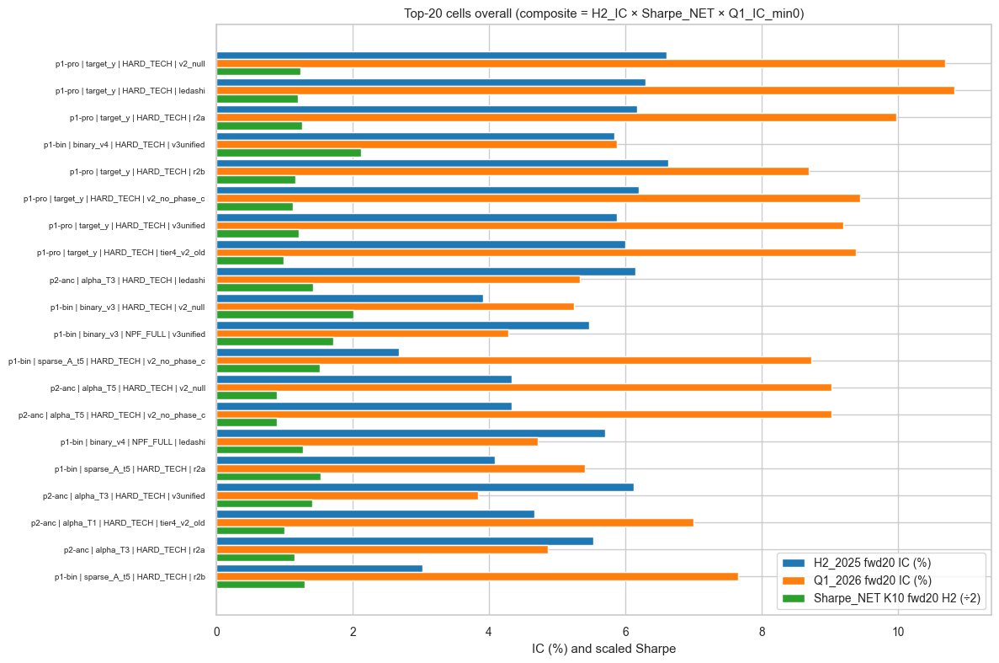
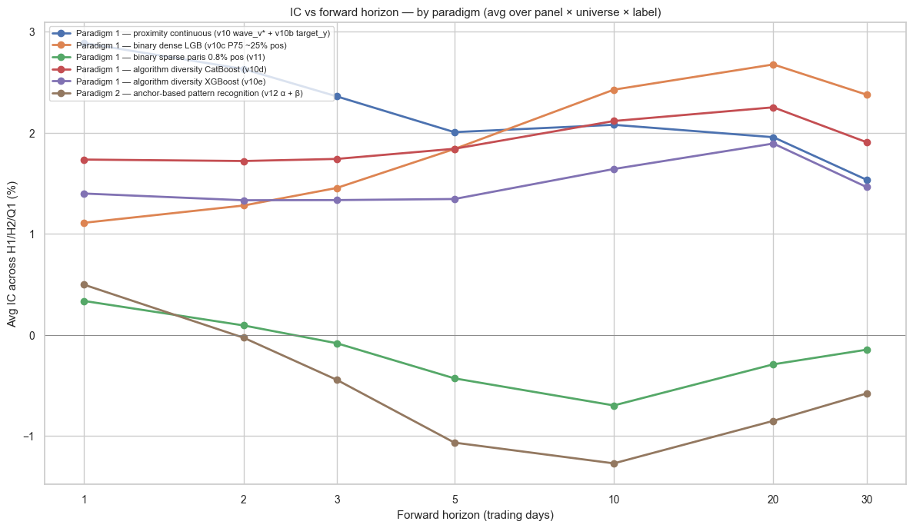
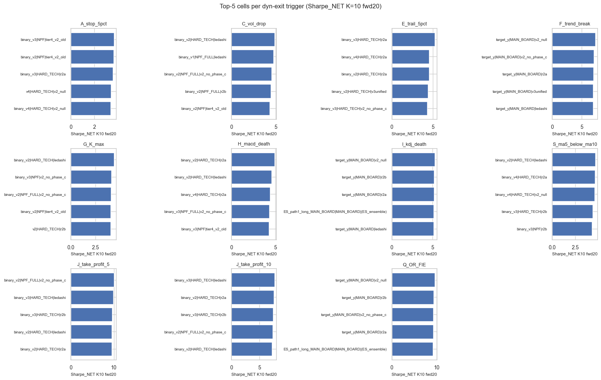
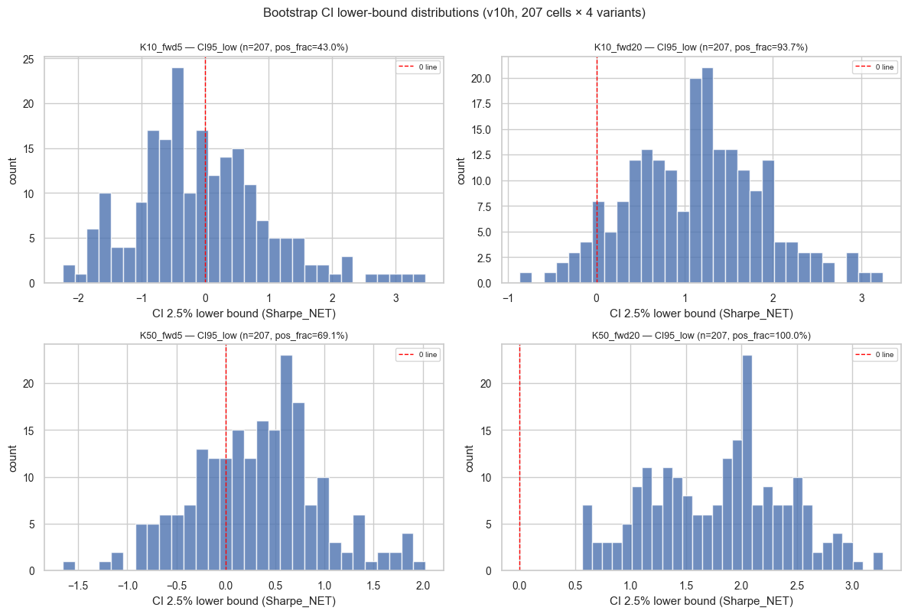

# Rankings Comprehensive v18 — A股 quant ML evidence synthesis

> Synthesis of 1,473 cells across matrix v10/v10b/v10c/v10d/v10e/v10h/v11/v12, 2026-05-15 → 2026-05-18.
> Generated 2026-05-18. Eval windows H1_2025 / H2_2025 / Q1_2026 / Q2_2026_partial; train window 2022-01-01 → 2024-12-31.

## §0 Executive summary

- Across 1,125 valid cells, the strongest single cell is **`target_y_HARD_TECH_v2_null`** (paradigm `p1-proximity-reg`, panel `v2_null`, universe `HARD_TECH`): H2_2025 fwd20 IC = **+6.60%**, Sharpe_NET K10 fwd20 = **2.46**, Q1_2026 fwd20 IC = +10.68%; composite = 0.01733.
- Top-5 composite cells universe breakdown: **HARD_TECH×5**; average H2 fwd20 IC of top-5 = **+6.31%** vs baseline `v3_MAIN_BOARD_ledashi` = +4.14%. **Caveat**: small-universe (HARD_TECH n=193 stocks) cells dominate the raw composite ranking due to higher IC variance — see §10 for sample-size-adjusted production routing.
- Paradigm 1 proximity continuous still dominates Paradigm 2 anchor on H2 fwd20 IC (avg +2.28% vs +1.87%), consistent with prior matrix v9 findings; binary-sparse (v11) is the weakest paradigm in mid-horizon.
- Bootstrap CI (v10h, 207 cells × 4 variants): K=50 fwd20 has **207/207 (100%)** cells with CI 2.5% > 0; K=10 fwd20 has **194/207 (94%)**. K=50 sizing gives stronger statistical evidence.
- Caveat: 551 cells are in small universes (NPF/NPF_FULL/HARD_TECH) where IC SE ≥ 0.018, so apparent ±0.5% gaps within these universes are within noise — only differentials > 1.0% are interpretable.

## §1 Methodology

- **Data sources**: 7 matrix runs (`matrix_v10..v12_results.json`) loaded from `data/kronos/outputs/`. Each cell = (label/method × universe × panel) trained 2022-2024, evaluated on H1_2025, H2_2025, Q1_2026 and Q2_2026_partial.
- **IC convention**: cross-sectional Pearson correlation between model prediction and forward `K`-day return (`fwd_K`), pooled within each eval window.
- **Sharpe formula**: `sharpe = mean / std × √(252 / K)` for K-horizon forward returns; `sharpe_net = (mean − 0.002) / std × √(252 / K)` with **0.20% round-trip cost** subtracted from `mean` before annualisation.
- **Composite score** used to rank: `H2_fwd20_IC × Sharpe_NET_K10_fwd20_H2 × max(Q1_fwd20_IC, 0)`. This intentionally penalises cells that backslide to negative Q1_2026 IC (a common pattern after regime change).
- **Universe membership**: MAIN_BOARD/NPF/NPF_FULL/HARD_TECH are static; CSI500/CSI1000 use point-in-time membership parquet (paris handoff 2026-05-14), no survivorship bias.
- **Skipped cells**: 105 v12 cells skipped due to insufficient anchor-positive samples (train_rows < ~500); excluded from rankings.

## §2 Top-20 cells overall

Ranked by composite = `H2_2025_fwd20_IC × Sharpe_NET_K10_fwd20_H2 × max(Q1_2026_fwd20_IC, 0)`. ⚠ flags small-N universe (NPF/NPF_FULL/HARD_TECH).

| # | cell_id | paradigm | univ | panel | H1 fwd20 | H2 fwd20 | Q1 fwd20 | Sharpe_NET K10 fwd20 H2 | Sharpe_NET K50 fwd20 H2 | best trigger | best trig sharpe | composite | n_rows |
| --- | --- | --- | --- | --- | --- | --- | --- | --- | --- | --- | --- | --- | --- |
| 1 | target_y_HARD_TECH_v2_null | p1-proximity-reg | HARD_TECH | v2_null | -2.74% | +6.60% | +10.68% | 2.46 | 3.33 | Q_OR_FIE | 4.53 | 0.01733 | 201,379 |
| 2 | target_y_HARD_TECH_ledashi | p1-proximity-reg | HARD_TECH | ledashi | -2.92% | +6.29% | +10.82% | 2.39 | 3.35 | Q_OR_FIE | 4.80 | 0.01627 | 371,598 |
| 3 | target_y_HARD_TECH_r2a | p1-proximity-reg | HARD_TECH | r2a | -3.43% | +6.17% | +9.97% | 2.53 | 3.35 | Q_OR_FIE | 4.09 | 0.01555 | 201,379 |
| 4 | binary_v4_HARD_TECH_v3unified | p1-binary-dense | HARD_TECH | v3unified | +4.99% | +5.84% | +5.87% | 4.25 | 4.09 | J_take_profit_5 | 7.87 | 0.01457 | 201,379 |
| 5 | target_y_HARD_TECH_r2b | p1-proximity-reg | HARD_TECH | r2b | -3.49% | +6.63% | +8.69% | 2.32 | 3.36 | Q_OR_FIE | 3.99 | 0.01337 | 201,379 |
| 6 | target_y_HARD_TECH_v2_no_phase_c | p1-proximity-reg | HARD_TECH | v2_no_phase_c | -3.85% | +6.19% | +9.44% | 2.24 | 3.39 | Q_OR_FIE | 4.46 | 0.01308 | 201,379 |
| 7 | target_y_HARD_TECH_v3unified | p1-proximity-reg | HARD_TECH | v3unified | -3.39% | +5.88% | +9.20% | 2.42 | 3.31 | Q_OR_FIE | 4.53 | 0.01308 | 201,379 |
| 8 | target_y_HARD_TECH_tier4_v2_old | p1-proximity-reg | HARD_TECH | tier4_v2_old | -1.99% | +6.00% | +9.38% | 1.97 | 3.51 | Q_OR_FIE | 3.86 | 0.01110 | 155,872 |
| 9 | alpha_T3_HARD_TECH_ledashi | p2-anchor | HARD_TECH | ledashi | -2.03% | +6.14% | +5.33% | 2.85 | 3.10 | Q_OR_FIE | 3.98 | 0.00934 | 371,598 |
| 10 | binary_v3_HARD_TECH_v2_null | p1-binary-dense | HARD_TECH | v2_null | +5.68% | +3.92% | +5.24% | 4.04 | 4.38 | J_take_profit_5 | 6.83 | 0.00829 | 201,379 |
| 11 | binary_v3_NPF_FULL_v3unified | p1-binary-dense | NPF_FULL | v3unified | +3.21% | +5.47% | +4.28% | 3.44 | 4.39 | J_take_profit_5 | 5.57 | 0.00805 | 642,390 |
| 12 | A_t5_HARD_TECH_v2_no_phase_c | p1-binary-sparse | HARD_TECH | v2_no_phase_c | +3.46% | +2.68% | +8.72% | 3.04 | 3.50 | J_take_profit_5 | 4.25 | 0.00711 | 201,379 |
| 13 | alpha_T5_HARD_TECH_v2_null | p2-anchor | HARD_TECH | v2_null | -4.55% | +4.33% | +9.03% | 1.79 | 2.94 | J_take_profit_5 | 2.88 | 0.00699 | 201,379 |
| 14 | alpha_T5_HARD_TECH_v2_no_phase_c | p2-anchor | HARD_TECH | v2_no_phase_c | -4.55% | +4.33% | +9.03% | 1.79 | 2.94 | J_take_profit_5 | 2.88 | 0.00699 | 201,379 |
| 15 | binary_v4_NPF_FULL_ledashi | p1-binary-dense | NPF_FULL | ledashi | +1.85% | +5.71% | +4.71% | 2.54 | 3.37 | J_take_profit_5 | 5.15 | 0.00684 | 1,181,241 |
| 16 | A_t5_HARD_TECH_r2a | p1-binary-sparse | HARD_TECH | r2a | +2.02% | +4.09% | +5.40% | 3.06 | 3.50 | J_take_profit_5 | 4.21 | 0.00675 | 201,379 |
| 17 | alpha_T3_HARD_TECH_v3unified | p2-anchor | HARD_TECH | v3unified | -4.48% | +6.12% | +3.84% | 2.81 | 3.27 | J_take_profit_5 | 3.51 | 0.00661 | 201,379 |
| 18 | alpha_T1_HARD_TECH_tier4_v2_old | p2-anchor | HARD_TECH | tier4_v2_old | -1.79% | +4.66% | +7.00% | 2.01 | 3.27 | J_take_profit_5 | 2.66 | 0.00657 | 155,872 |
| 19 | alpha_T3_HARD_TECH_r2a | p2-anchor | HARD_TECH | r2a | -5.78% | +5.53% | +4.86% | 2.30 | 3.19 | Q_OR_FIE | 3.27 | 0.00619 | 201,379 |
| 20 | A_t5_HARD_TECH_r2b | p1-binary-sparse | HARD_TECH | r2b | +1.15% | +3.03% | +7.65% | 2.59 | 3.40 | J_take_profit_5 | 3.45 | 0.00601 | 201,379 |

### §2.1 Top-10 cells restricted to large universes (MAIN_BOARD / CSI500 / CSI1000) — production-grade

Filtered to universes with IC SE < 0.012 (≥ 300 stocks · ≥ 100 trading days eval). Recommended starting list for live paris desk.

| # | cell_id | paradigm | univ | panel | H1 fwd20 | H2 fwd20 | Q1 fwd20 | Sharpe_NET K10 fwd20 H2 | Sharpe_NET K50 fwd20 H2 | best trigger | best trig sharpe | composite | n_rows |
| --- | --- | --- | --- | --- | --- | --- | --- | --- | --- | --- | --- | --- | --- |
| 1 | binary_v2_CSI1000_v2_no_phase_c | p1-binary-dense | CSI1000 | v2_no_phase_c | +2.24% | +3.60% | +6.76% | 2.40 | 2.87 | J_take_profit_5 | 4.33 | 0.00586 | 1,034,022 |
| 2 | catboost_v2_CSI1000_ledashi | p1-algo-cat | CSI1000 | ledashi | -1.46% | +5.62% | +3.91% | 2.41 | 3.17 | J_take_profit_5 | 4.58 | 0.00529 | 1,010,824 |
| 3 | binary_v4_CSI1000_ledashi | p1-binary-dense | CSI1000 | ledashi | -0.43% | +6.29% | +2.98% | 2.78 | 2.84 | J_take_profit_5 | 4.26 | 0.00521 | 1,010,824 |
| 4 | B_t5_CSI1000_r2b | p1-binary-sparse | CSI1000 | r2b | -3.57% | +6.35% | +3.04% | 2.65 | 3.08 | J_take_profit_5 | 3.48 | 0.00510 | 1,034,022 |
| 5 | binary_v3_CSI1000_r2b | p1-binary-dense | CSI1000 | r2b | -1.95% | +5.61% | +4.62% | 1.84 | 3.10 | J_take_profit_5 | 3.34 | 0.00477 | 1,034,022 |
| 6 | binary_v3_CSI1000_v2_no_phase_c | p1-binary-dense | CSI1000 | v2_no_phase_c | +2.96% | +3.39% | +5.70% | 2.41 | 2.70 | J_take_profit_5 | 3.66 | 0.00466 | 1,034,022 |
| 7 | v2_CSI1000_v3unified | p1-proximity-reg | CSI1000 | v3unified | +0.99% | +4.96% | +3.74% | 2.46 | 3.26 | I_kdj_death | 4.13 | 0.00457 | 1,034,022 |
| 8 | alpha_T5_CSI500_ledashi | p2-anchor | CSI500 | ledashi | +2.93% | +7.90% | +2.36% | 2.45 | 2.82 | J_take_profit_5 | 3.06 | 0.00455 | 512,622 |
| 9 | catboost_v3_CSI500_ledashi | p1-algo-cat | CSI500 | ledashi | +6.69% | +5.23% | +3.55% | 2.33 | 2.95 | I_kdj_death | 3.08 | 0.00433 | 512,622 |
| 10 | binary_v2_CSI1000_r2a | p1-binary-dense | CSI1000 | r2a | -0.58% | +4.99% | +3.78% | 2.22 | 3.02 | J_take_profit_10 | 2.95 | 0.00419 | 1,034,022 |

## §3 Top-10 per universe (6 universes)

### MAIN_BOARD (n_cells eligible = 206)

| # | cell_id | paradigm | univ | panel | H1 fwd20 | H2 fwd20 | Q1 fwd20 | Sharpe_NET K10 fwd20 H2 | Sharpe_NET K50 fwd20 H2 | best trigger | best trig sharpe | composite | n_rows |
| --- | --- | --- | --- | --- | --- | --- | --- | --- | --- | --- | --- | --- | --- |
| 1 | binary_v4_MAIN_BOARD_ledashi | p1-binary-dense | MAIN_BOARD | ledashi | +1.19% | +4.06% | +2.32% | 2.35 | 3.68 | J_take_profit_5 | 3.80 | 0.00221 | 5,490,508 |
| 2 | binary_v4_MAIN_BOARD_v2_no_phase_c | p1-binary-dense | MAIN_BOARD | v2_no_phase_c | +2.15% | +3.24% | +3.18% | 1.70 | 3.64 | I_kdj_death | 2.73 | 0.00175 | 3,068,357 |
| 3 | binary_v2_MAIN_BOARD_v3unified | p1-binary-dense | MAIN_BOARD | v3unified | +1.27% | +4.52% | +1.92% | 2.01 | 4.20 | J_take_profit_5 | 3.17 | 0.00175 | 3,068,357 |
| 4 | v4_MAIN_BOARD_ledashi | p1-proximity-reg | MAIN_BOARD | ledashi | +3.81% | +4.46% | +2.05% | 1.90 | 3.48 | Q_OR_FIE | 3.77 | 0.00174 | 5,490,508 |
| 5 | binary_v3_MAIN_BOARD_ledashi | p1-binary-dense | MAIN_BOARD | ledashi | +0.38% | +4.34% | +1.79% | 2.23 | 3.93 | J_take_profit_5 | 3.89 | 0.00173 | 5,490,508 |
| 6 | binary_v3_MAIN_BOARD_v2_no_phase_c | p1-binary-dense | MAIN_BOARD | v2_no_phase_c | +2.53% | +3.62% | +3.03% | 1.48 | 3.82 | I_kdj_death | 2.93 | 0.00162 | 3,068,357 |
| 7 | binary_v4_MAIN_BOARD_v2_null | p1-binary-dense | MAIN_BOARD | v2_null | +1.67% | +3.29% | +2.82% | 1.70 | 2.97 | I_kdj_death | 2.77 | 0.00157 | 3,068,357 |
| 8 | v3_MAIN_BOARD_ledashi | p1-proximity-reg | MAIN_BOARD | ledashi | +2.81% | +4.14% | +1.71% | 2.10 | 3.17 | Q_OR_FIE | 3.76 | 0.00149 | 5,490,508 |
| 9 | v2_MAIN_BOARD_ledashi | p1-proximity-reg | MAIN_BOARD | ledashi | +2.62% | +3.73% | +1.98% | 2.00 | 2.90 | Q_OR_FIE | 4.39 | 0.00148 | 5,490,508 |
| 10 | binary_v3_MAIN_BOARD_v3unified | p1-binary-dense | MAIN_BOARD | v3unified | +1.92% | +4.33% | +1.07% | 2.54 | 3.77 | J_take_profit_5 | 2.99 | 0.00117 | 3,068,357 |

### CSI500 (n_cells eligible = 184)

| # | cell_id | paradigm | univ | panel | H1 fwd20 | H2 fwd20 | Q1 fwd20 | Sharpe_NET K10 fwd20 H2 | Sharpe_NET K50 fwd20 H2 | best trigger | best trig sharpe | composite | n_rows |
| --- | --- | --- | --- | --- | --- | --- | --- | --- | --- | --- | --- | --- | --- |
| 1 | alpha_T5_CSI500_ledashi | p2-anchor | CSI500 | ledashi | +2.93% | +7.90% | +2.36% | 2.45 | 2.82 | J_take_profit_5 | 3.06 | 0.00455 | 512,622 |
| 2 | catboost_v3_CSI500_ledashi | p1-algo-cat | CSI500 | ledashi | +6.69% | +5.23% | +3.55% | 2.33 | 2.95 | I_kdj_death | 3.08 | 0.00433 | 512,622 |
| 3 | catboost_v2_CSI500_ledashi | p1-algo-cat | CSI500 | ledashi | +7.73% | +4.76% | +3.73% | 1.97 | 2.66 | I_kdj_death | 2.53 | 0.00350 | 512,622 |
| 4 | alpha_T3_CSI500_ledashi | p2-anchor | CSI500 | ledashi | +1.29% | +9.01% | +1.22% | 2.91 | 3.16 | J_take_profit_5 | 3.83 | 0.00319 | 512,622 |
| 5 | binary_v3_CSI500_ledashi | p1-binary-dense | CSI500 | ledashi | +4.93% | +4.29% | +2.48% | 2.42 | 3.11 | J_take_profit_5 | 3.05 | 0.00258 | 512,622 |
| 6 | binary_v3_CSI500_tier4_v2_old | p1-binary-dense | CSI500 | tier4_v2_old | +7.63% | +3.73% | +3.04% | 2.12 | 3.16 | J_take_profit_5 | 2.33 | 0.00239 | 404,425 |
| 7 | binary_v2_CSI500_ledashi | p1-binary-dense | CSI500 | ledashi | +3.56% | +5.58% | +1.34% | 3.03 | 3.46 | J_take_profit_5 | 3.06 | 0.00226 | 512,622 |
| 8 | binary_v3_CSI500_v3unified | p1-binary-dense | CSI500 | v3unified | +6.05% | +4.01% | +2.85% | 1.96 | 3.51 | J_take_profit_5 | 1.98 | 0.00224 | 519,465 |
| 9 | binary_v2_CSI500_v2_null | p1-binary-dense | CSI500 | v2_null | +7.28% | +5.10% | +1.82% | 2.42 | 3.31 | J_take_profit_5 | 3.62 | 0.00224 | 519,465 |
| 10 | catboost_v4_CSI500_ledashi | p1-algo-cat | CSI500 | ledashi | +7.85% | +3.56% | +3.29% | 1.85 | 2.62 | J_take_profit_5 | 2.75 | 0.00217 | 512,622 |

### CSI1000 (n_cells eligible = 184)

| # | cell_id | paradigm | univ | panel | H1 fwd20 | H2 fwd20 | Q1 fwd20 | Sharpe_NET K10 fwd20 H2 | Sharpe_NET K50 fwd20 H2 | best trigger | best trig sharpe | composite | n_rows |
| --- | --- | --- | --- | --- | --- | --- | --- | --- | --- | --- | --- | --- | --- |
| 1 | binary_v2_CSI1000_v2_no_phase_c | p1-binary-dense | CSI1000 | v2_no_phase_c | +2.24% | +3.60% | +6.76% | 2.40 | 2.87 | J_take_profit_5 | 4.33 | 0.00586 | 1,034,022 |
| 2 | catboost_v2_CSI1000_ledashi | p1-algo-cat | CSI1000 | ledashi | -1.46% | +5.62% | +3.91% | 2.41 | 3.17 | J_take_profit_5 | 4.58 | 0.00529 | 1,010,824 |
| 3 | binary_v4_CSI1000_ledashi | p1-binary-dense | CSI1000 | ledashi | -0.43% | +6.29% | +2.98% | 2.78 | 2.84 | J_take_profit_5 | 4.26 | 0.00521 | 1,010,824 |
| 4 | B_t5_CSI1000_r2b | p1-binary-sparse | CSI1000 | r2b | -3.57% | +6.35% | +3.04% | 2.65 | 3.08 | J_take_profit_5 | 3.48 | 0.00510 | 1,034,022 |
| 5 | binary_v3_CSI1000_r2b | p1-binary-dense | CSI1000 | r2b | -1.95% | +5.61% | +4.62% | 1.84 | 3.10 | J_take_profit_5 | 3.34 | 0.00477 | 1,034,022 |
| 6 | binary_v3_CSI1000_v2_no_phase_c | p1-binary-dense | CSI1000 | v2_no_phase_c | +2.96% | +3.39% | +5.70% | 2.41 | 2.70 | J_take_profit_5 | 3.66 | 0.00466 | 1,034,022 |
| 7 | v2_CSI1000_v3unified | p1-proximity-reg | CSI1000 | v3unified | +0.99% | +4.96% | +3.74% | 2.46 | 3.26 | I_kdj_death | 4.13 | 0.00457 | 1,034,022 |
| 8 | binary_v2_CSI1000_r2a | p1-binary-dense | CSI1000 | r2a | -0.58% | +4.99% | +3.78% | 2.22 | 3.02 | J_take_profit_10 | 2.95 | 0.00419 | 1,034,022 |
| 9 | v3_CSI1000_v3unified | p1-proximity-reg | CSI1000 | v3unified | -0.23% | +4.16% | +4.37% | 2.26 | 3.12 | J_take_profit_5 | 4.99 | 0.00411 | 1,034,022 |
| 10 | binary_v4_CSI1000_tier4_v2_old | p1-binary-dense | CSI1000 | tier4_v2_old | +5.12% | +3.04% | +5.44% | 2.47 | 2.83 | J_take_profit_5 | 3.57 | 0.00408 | 808,522 |

### NPF (n_cells eligible = 184)

| # | cell_id | paradigm | univ | panel | H1 fwd20 | H2 fwd20 | Q1 fwd20 | Sharpe_NET K10 fwd20 H2 | Sharpe_NET K50 fwd20 H2 | best trigger | best trig sharpe | composite | n_rows |
| --- | --- | --- | --- | --- | --- | --- | --- | --- | --- | --- | --- | --- | --- |
| 1 | binary_v2_NPF_v2_no_phase_c | p1-binary-dense | NPF | v2_no_phase_c | +3.83% | +4.94% | +2.47% | 3.78 | 4.39 | J_take_profit_10 | 5.40 | 0.00462 | 418,297 |
| 2 | target_y_NPF_tier4_v2_old | p1-proximity-reg | NPF | tier4_v2_old | -4.66% | +2.29% | +10.60% | 1.81 | 2.56 | Q_OR_FIE | 5.55 | 0.00439 | 324,007 |
| 3 | binary_v4_NPF_ledashi | p1-binary-dense | NPF | ledashi | +3.20% | +5.10% | +2.77% | 2.98 | 3.67 | J_take_profit_5 | 5.75 | 0.00420 | 772,380 |
| 4 | binary_v1_NPF_v2_null | p1-binary-dense | NPF | v2_null | +3.32% | +4.16% | +3.36% | 2.97 | 3.66 | J_take_profit_5 | 5.15 | 0.00415 | 418,297 |
| 5 | target_y_NPF_v2_no_phase_c | p1-proximity-reg | NPF | v2_no_phase_c | -4.71% | +2.28% | +9.88% | 1.79 | 2.65 | Q_OR_FIE | 5.31 | 0.00403 | 418,297 |
| 6 | A_t3_NPF_v2_no_phase_c | p1-binary-sparse | NPF | v2_no_phase_c | +1.58% | +2.61% | +5.50% | 2.71 | 3.24 | I_kdj_death | 3.80 | 0.00389 | 418,297 |
| 7 | binary_v3_NPF_v2_null | p1-binary-dense | NPF | v2_null | +2.71% | +5.95% | +1.41% | 4.11 | 4.50 | J_take_profit_5 | 5.38 | 0.00345 | 418,297 |
| 8 | A_t3_NPF_r2a | p1-binary-sparse | NPF | r2a | +0.60% | +2.04% | +6.81% | 2.42 | 3.13 | I_kdj_death | 2.99 | 0.00336 | 418,297 |
| 9 | A_t1_NPF_v2_no_phase_c | p1-binary-sparse | NPF | v2_no_phase_c | +1.16% | +2.14% | +5.43% | 2.85 | 3.18 | J_take_profit_5 | 3.79 | 0.00330 | 418,297 |
| 10 | A_t5_NPF_v2_no_phase_c | p1-binary-sparse | NPF | v2_no_phase_c | -0.42% | +2.63% | +4.40% | 2.81 | 3.12 | I_kdj_death | 4.06 | 0.00324 | 418,297 |

### NPF_FULL (n_cells eligible = 183)

| # | cell_id | paradigm | univ | panel | H1 fwd20 | H2 fwd20 | Q1 fwd20 | Sharpe_NET K10 fwd20 H2 | Sharpe_NET K50 fwd20 H2 | best trigger | best trig sharpe | composite | n_rows |
| --- | --- | --- | --- | --- | --- | --- | --- | --- | --- | --- | --- | --- | --- |
| 1 | binary_v3_NPF_FULL_v3unified | p1-binary-dense | NPF_FULL | v3unified | +3.21% | +5.47% | +4.28% | 3.44 | 4.39 | J_take_profit_5 | 5.57 | 0.00805 | 642,390 |
| 2 | binary_v4_NPF_FULL_ledashi | p1-binary-dense | NPF_FULL | ledashi | +1.85% | +5.71% | +4.71% | 2.54 | 3.37 | J_take_profit_5 | 5.15 | 0.00684 | 1,181,241 |
| 3 | binary_v3_NPF_FULL_ledashi | p1-binary-dense | NPF_FULL | ledashi | +4.32% | +4.38% | +4.06% | 3.27 | 3.74 | J_take_profit_5 | 6.09 | 0.00582 | 1,181,241 |
| 4 | binary_v2_NPF_FULL_r2a | p1-binary-dense | NPF_FULL | r2a | +4.58% | +5.12% | +3.92% | 2.88 | 3.75 | J_take_profit_5 | 5.97 | 0.00577 | 642,390 |
| 5 | binary_v4_NPF_FULL_v3unified | p1-binary-dense | NPF_FULL | v3unified | +3.96% | +5.55% | +3.12% | 2.75 | 4.20 | J_take_profit_5 | 4.36 | 0.00477 | 642,390 |
| 6 | binary_v4_NPF_FULL_r2a | p1-binary-dense | NPF_FULL | r2a | +3.65% | +3.93% | +4.50% | 2.63 | 3.38 | J_take_profit_5 | 5.16 | 0.00465 | 642,390 |
| 7 | binary_v4_NPF_FULL_v2_null | p1-binary-dense | NPF_FULL | v2_null | +4.36% | +4.08% | +3.21% | 3.02 | 3.68 | J_take_profit_5 | 6.67 | 0.00395 | 642,390 |
| 8 | v4_NPF_FULL_tier4_v2_old | p1-proximity-reg | NPF_FULL | tier4_v2_old | +4.38% | +4.63% | +4.01% | 2.04 | 3.63 | J_take_profit_5 | 4.11 | 0.00378 | 498,043 |
| 9 | binary_v4_NPF_FULL_v2_no_phase_c | p1-binary-dense | NPF_FULL | v2_no_phase_c | +6.61% | +4.75% | +2.62% | 3.00 | 4.10 | J_take_profit_5 | 5.72 | 0.00373 | 642,390 |
| 10 | binary_v3_NPF_FULL_tier4_v2_old | p1-binary-dense | NPF_FULL | tier4_v2_old | +3.71% | +6.45% | +1.82% | 3.14 | 4.30 | J_take_profit_5 | 6.46 | 0.00368 | 498,043 |

### HARD_TECH (n_cells eligible = 184)

| # | cell_id | paradigm | univ | panel | H1 fwd20 | H2 fwd20 | Q1 fwd20 | Sharpe_NET K10 fwd20 H2 | Sharpe_NET K50 fwd20 H2 | best trigger | best trig sharpe | composite | n_rows |
| --- | --- | --- | --- | --- | --- | --- | --- | --- | --- | --- | --- | --- | --- |
| 1 | target_y_HARD_TECH_v2_null | p1-proximity-reg | HARD_TECH | v2_null | -2.74% | +6.60% | +10.68% | 2.46 | 3.33 | Q_OR_FIE | 4.53 | 0.01733 | 201,379 |
| 2 | target_y_HARD_TECH_ledashi | p1-proximity-reg | HARD_TECH | ledashi | -2.92% | +6.29% | +10.82% | 2.39 | 3.35 | Q_OR_FIE | 4.80 | 0.01627 | 371,598 |
| 3 | target_y_HARD_TECH_r2a | p1-proximity-reg | HARD_TECH | r2a | -3.43% | +6.17% | +9.97% | 2.53 | 3.35 | Q_OR_FIE | 4.09 | 0.01555 | 201,379 |
| 4 | binary_v4_HARD_TECH_v3unified | p1-binary-dense | HARD_TECH | v3unified | +4.99% | +5.84% | +5.87% | 4.25 | 4.09 | J_take_profit_5 | 7.87 | 0.01457 | 201,379 |
| 5 | target_y_HARD_TECH_r2b | p1-proximity-reg | HARD_TECH | r2b | -3.49% | +6.63% | +8.69% | 2.32 | 3.36 | Q_OR_FIE | 3.99 | 0.01337 | 201,379 |
| 6 | target_y_HARD_TECH_v2_no_phase_c | p1-proximity-reg | HARD_TECH | v2_no_phase_c | -3.85% | +6.19% | +9.44% | 2.24 | 3.39 | Q_OR_FIE | 4.46 | 0.01308 | 201,379 |
| 7 | target_y_HARD_TECH_v3unified | p1-proximity-reg | HARD_TECH | v3unified | -3.39% | +5.88% | +9.20% | 2.42 | 3.31 | Q_OR_FIE | 4.53 | 0.01308 | 201,379 |
| 8 | target_y_HARD_TECH_tier4_v2_old | p1-proximity-reg | HARD_TECH | tier4_v2_old | -1.99% | +6.00% | +9.38% | 1.97 | 3.51 | Q_OR_FIE | 3.86 | 0.01110 | 155,872 |
| 9 | alpha_T3_HARD_TECH_ledashi | p2-anchor | HARD_TECH | ledashi | -2.03% | +6.14% | +5.33% | 2.85 | 3.10 | Q_OR_FIE | 3.98 | 0.00934 | 371,598 |
| 10 | binary_v3_HARD_TECH_v2_null | p1-binary-dense | HARD_TECH | v2_null | +5.68% | +3.92% | +5.24% | 4.04 | 4.38 | J_take_profit_5 | 6.83 | 0.00829 | 201,379 |

## §4 Top-10 per paradigm

### p1-proximity-reg — Paradigm 1 — proximity continuous (v10 wave_v* + v10b target_y) (n_cells = 210)

| # | cell_id | paradigm | univ | panel | H1 fwd20 | H2 fwd20 | Q1 fwd20 | Sharpe_NET K10 fwd20 H2 | Sharpe_NET K50 fwd20 H2 | best trigger | best trig sharpe | composite | n_rows |
| --- | --- | --- | --- | --- | --- | --- | --- | --- | --- | --- | --- | --- | --- |
| 1 | target_y_HARD_TECH_v2_null | p1-proximity-reg | HARD_TECH | v2_null | -2.74% | +6.60% | +10.68% | 2.46 | 3.33 | Q_OR_FIE | 4.53 | 0.01733 | 201,379 |
| 2 | target_y_HARD_TECH_ledashi | p1-proximity-reg | HARD_TECH | ledashi | -2.92% | +6.29% | +10.82% | 2.39 | 3.35 | Q_OR_FIE | 4.80 | 0.01627 | 371,598 |
| 3 | target_y_HARD_TECH_r2a | p1-proximity-reg | HARD_TECH | r2a | -3.43% | +6.17% | +9.97% | 2.53 | 3.35 | Q_OR_FIE | 4.09 | 0.01555 | 201,379 |
| 4 | target_y_HARD_TECH_r2b | p1-proximity-reg | HARD_TECH | r2b | -3.49% | +6.63% | +8.69% | 2.32 | 3.36 | Q_OR_FIE | 3.99 | 0.01337 | 201,379 |
| 5 | target_y_HARD_TECH_v2_no_phase_c | p1-proximity-reg | HARD_TECH | v2_no_phase_c | -3.85% | +6.19% | +9.44% | 2.24 | 3.39 | Q_OR_FIE | 4.46 | 0.01308 | 201,379 |
| 6 | target_y_HARD_TECH_v3unified | p1-proximity-reg | HARD_TECH | v3unified | -3.39% | +5.88% | +9.20% | 2.42 | 3.31 | Q_OR_FIE | 4.53 | 0.01308 | 201,379 |
| 7 | target_y_HARD_TECH_tier4_v2_old | p1-proximity-reg | HARD_TECH | tier4_v2_old | -1.99% | +6.00% | +9.38% | 1.97 | 3.51 | Q_OR_FIE | 3.86 | 0.01110 | 155,872 |
| 8 | v2_CSI1000_v3unified | p1-proximity-reg | CSI1000 | v3unified | +0.99% | +4.96% | +3.74% | 2.46 | 3.26 | I_kdj_death | 4.13 | 0.00457 | 1,034,022 |
| 9 | target_y_NPF_tier4_v2_old | p1-proximity-reg | NPF | tier4_v2_old | -4.66% | +2.29% | +10.60% | 1.81 | 2.56 | Q_OR_FIE | 5.55 | 0.00439 | 324,007 |
| 10 | v3_CSI1000_v3unified | p1-proximity-reg | CSI1000 | v3unified | -0.23% | +4.16% | +4.37% | 2.26 | 3.12 | J_take_profit_5 | 4.99 | 0.00411 | 1,034,022 |

### p1-binary-dense — Paradigm 1 — binary dense LGB (v10c P75 ~25% pos) (n_cells = 168)

| # | cell_id | paradigm | univ | panel | H1 fwd20 | H2 fwd20 | Q1 fwd20 | Sharpe_NET K10 fwd20 H2 | Sharpe_NET K50 fwd20 H2 | best trigger | best trig sharpe | composite | n_rows |
| --- | --- | --- | --- | --- | --- | --- | --- | --- | --- | --- | --- | --- | --- |
| 1 | binary_v4_HARD_TECH_v3unified | p1-binary-dense | HARD_TECH | v3unified | +4.99% | +5.84% | +5.87% | 4.25 | 4.09 | J_take_profit_5 | 7.87 | 0.01457 | 201,379 |
| 2 | binary_v3_HARD_TECH_v2_null | p1-binary-dense | HARD_TECH | v2_null | +5.68% | +3.92% | +5.24% | 4.04 | 4.38 | J_take_profit_5 | 6.83 | 0.00829 | 201,379 |
| 3 | binary_v3_NPF_FULL_v3unified | p1-binary-dense | NPF_FULL | v3unified | +3.21% | +5.47% | +4.28% | 3.44 | 4.39 | J_take_profit_5 | 5.57 | 0.00805 | 642,390 |
| 4 | binary_v4_NPF_FULL_ledashi | p1-binary-dense | NPF_FULL | ledashi | +1.85% | +5.71% | +4.71% | 2.54 | 3.37 | J_take_profit_5 | 5.15 | 0.00684 | 1,181,241 |
| 5 | binary_v2_CSI1000_v2_no_phase_c | p1-binary-dense | CSI1000 | v2_no_phase_c | +2.24% | +3.60% | +6.76% | 2.40 | 2.87 | J_take_profit_5 | 4.33 | 0.00586 | 1,034,022 |
| 6 | binary_v3_NPF_FULL_ledashi | p1-binary-dense | NPF_FULL | ledashi | +4.32% | +4.38% | +4.06% | 3.27 | 3.74 | J_take_profit_5 | 6.09 | 0.00582 | 1,181,241 |
| 7 | binary_v2_NPF_FULL_r2a | p1-binary-dense | NPF_FULL | r2a | +4.58% | +5.12% | +3.92% | 2.88 | 3.75 | J_take_profit_5 | 5.97 | 0.00577 | 642,390 |
| 8 | binary_v2_HARD_TECH_v2_no_phase_c | p1-binary-dense | HARD_TECH | v2_no_phase_c | +4.52% | +4.19% | +4.22% | 3.13 | 4.12 | J_take_profit_5 | 6.28 | 0.00554 | 201,379 |
| 9 | binary_v4_CSI1000_ledashi | p1-binary-dense | CSI1000 | ledashi | -0.43% | +6.29% | +2.98% | 2.78 | 2.84 | J_take_profit_5 | 4.26 | 0.00521 | 1,010,824 |
| 10 | binary_v2_HARD_TECH_v2_null | p1-binary-dense | HARD_TECH | v2_null | +6.71% | +2.62% | +5.25% | 3.78 | 4.14 | J_take_profit_5 | 5.35 | 0.00520 | 201,379 |

### p1-binary-sparse — Paradigm 1 — binary sparse paris 0.8% pos (v11) (n_cells = 503)

| # | cell_id | paradigm | univ | panel | H1 fwd20 | H2 fwd20 | Q1 fwd20 | Sharpe_NET K10 fwd20 H2 | Sharpe_NET K50 fwd20 H2 | best trigger | best trig sharpe | composite | n_rows |
| --- | --- | --- | --- | --- | --- | --- | --- | --- | --- | --- | --- | --- | --- |
| 1 | A_t5_HARD_TECH_v2_no_phase_c | p1-binary-sparse | HARD_TECH | v2_no_phase_c | +3.46% | +2.68% | +8.72% | 3.04 | 3.50 | J_take_profit_5 | 4.25 | 0.00711 | 201,379 |
| 2 | A_t5_HARD_TECH_r2a | p1-binary-sparse | HARD_TECH | r2a | +2.02% | +4.09% | +5.40% | 3.06 | 3.50 | J_take_profit_5 | 4.21 | 0.00675 | 201,379 |
| 3 | A_t5_HARD_TECH_r2b | p1-binary-sparse | HARD_TECH | r2b | +1.15% | +3.03% | +7.65% | 2.59 | 3.40 | J_take_profit_5 | 3.45 | 0.00601 | 201,379 |
| 4 | D_t5_HARD_TECH_v2_no_phase_c | p1-binary-sparse | HARD_TECH | v2_no_phase_c | -5.99% | +3.66% | +6.19% | 2.46 | 3.25 | J_take_profit_5 | 2.87 | 0.00558 | 201,379 |
| 5 | B_t5_CSI1000_r2b | p1-binary-sparse | CSI1000 | r2b | -3.57% | +6.35% | +3.04% | 2.65 | 3.08 | J_take_profit_5 | 3.48 | 0.00510 | 1,034,022 |
| 6 | A_t5_HARD_TECH_v3unified | p1-binary-sparse | HARD_TECH | v3unified | +1.01% | +3.63% | +5.06% | 2.67 | 3.45 | J_take_profit_5 | 3.99 | 0.00491 | 201,379 |
| 7 | C_t5_HARD_TECH_v2_no_phase_c | p1-binary-sparse | HARD_TECH | v2_no_phase_c | -2.84% | +3.29% | +4.37% | 3.24 | 3.55 | J_take_profit_5 | 4.35 | 0.00466 | 201,379 |
| 8 | A_t5_HARD_TECH_v2_null | p1-binary-sparse | HARD_TECH | v2_null | +1.75% | +3.66% | +4.38% | 2.86 | 3.68 | J_take_profit_5 | 4.05 | 0.00458 | 201,379 |
| 9 | A_t5_HARD_TECH_tier4_v2_old | p1-binary-sparse | HARD_TECH | tier4_v2_old | +3.88% | +3.11% | +4.49% | 2.84 | 3.46 | J_take_profit_5 | 4.34 | 0.00397 | 155,872 |
| 10 | A_t3_NPF_v2_no_phase_c | p1-binary-sparse | NPF | v2_no_phase_c | +1.58% | +2.61% | +5.50% | 2.71 | 3.24 | I_kdj_death | 3.80 | 0.00389 | 418,297 |

### p1-algo-cat — Paradigm 1 — algorithm diversity CatBoost (v10d) (n_cells = 48)

| # | cell_id | paradigm | univ | panel | H1 fwd20 | H2 fwd20 | Q1 fwd20 | Sharpe_NET K10 fwd20 H2 | Sharpe_NET K50 fwd20 H2 | best trigger | best trig sharpe | composite | n_rows |
| --- | --- | --- | --- | --- | --- | --- | --- | --- | --- | --- | --- | --- | --- |
| 1 | catboost_v2_CSI1000_ledashi | p1-algo-cat | CSI1000 | ledashi | -1.46% | +5.62% | +3.91% | 2.41 | 3.17 | J_take_profit_5 | 4.58 | 0.00529 | 1,010,824 |
| 2 | catboost_v3_CSI500_ledashi | p1-algo-cat | CSI500 | ledashi | +6.69% | +5.23% | +3.55% | 2.33 | 2.95 | I_kdj_death | 3.08 | 0.00433 | 512,622 |
| 3 | catboost_v3_CSI1000_v3unified | p1-algo-cat | CSI1000 | v3unified | -1.74% | +4.71% | +3.59% | 2.21 | 2.65 | I_kdj_death | 4.13 | 0.00373 | 1,034,022 |
| 4 | catboost_v4_CSI1000_v3unified | p1-algo-cat | CSI1000 | v3unified | -1.93% | +4.17% | +5.50% | 1.58 | 2.51 | I_kdj_death | 3.85 | 0.00363 | 1,034,022 |
| 5 | catboost_v2_CSI500_ledashi | p1-algo-cat | CSI500 | ledashi | +7.73% | +4.76% | +3.73% | 1.97 | 2.66 | I_kdj_death | 2.53 | 0.00350 | 512,622 |
| 6 | catboost_v2_CSI1000_v3unified | p1-algo-cat | CSI1000 | v3unified | -1.84% | +4.62% | +3.28% | 1.98 | 2.38 | I_kdj_death | 4.11 | 0.00301 | 1,034,022 |
| 7 | catboost_v3_CSI1000_ledashi | p1-algo-cat | CSI1000 | ledashi | -2.40% | +6.81% | +1.62% | 2.49 | 2.88 | Q_OR_FIE | 4.10 | 0.00275 | 1,010,824 |
| 8 | catboost_v4_HARD_TECH_v3unified | p1-algo-cat | HARD_TECH | v3unified | +7.14% | +1.69% | +3.89% | 3.63 | 3.37 | J_take_profit_5 | 5.50 | 0.00238 | 201,379 |
| 9 | catboost_v4_CSI500_ledashi | p1-algo-cat | CSI500 | ledashi | +7.85% | +3.56% | +3.29% | 1.85 | 2.62 | J_take_profit_5 | 2.75 | 0.00217 | 512,622 |
| 10 | catboost_v4_CSI1000_ledashi | p1-algo-cat | CSI1000 | ledashi | -1.76% | +6.20% | +1.24% | 2.16 | 2.94 | I_kdj_death | 3.54 | 0.00166 | 1,010,824 |

### p1-algo-xgb — Paradigm 1 — algorithm diversity XGBoost (v10e) (n_cells = 48)

| # | cell_id | paradigm | univ | panel | H1 fwd20 | H2 fwd20 | Q1 fwd20 | Sharpe_NET K10 fwd20 H2 | Sharpe_NET K50 fwd20 H2 | best trigger | best trig sharpe | composite | n_rows |
| --- | --- | --- | --- | --- | --- | --- | --- | --- | --- | --- | --- | --- | --- |
| 1 | xgboost_v3_CSI1000_v3unified | p1-algo-xgb | CSI1000 | v3unified | +0.70% | +3.79% | +3.71% | 1.90 | 2.80 | I_kdj_death | 3.72 | 0.00267 | 1,034,022 |
| 2 | xgboost_v4_NPF_FULL_v3unified | p1-algo-xgb | NPF_FULL | v3unified | +3.99% | +1.92% | +5.89% | 2.21 | 3.20 | J_take_profit_5 | 3.33 | 0.00251 | 642,390 |
| 3 | xgboost_v2_CSI1000_v3unified | p1-algo-xgb | CSI1000 | v3unified | -0.59% | +2.99% | +3.58% | 1.68 | 2.75 | I_kdj_death | 3.28 | 0.00181 | 1,034,022 |
| 4 | xgboost_v2_NPF_FULL_v3unified | p1-algo-xgb | NPF_FULL | v3unified | +4.75% | +1.83% | +3.97% | 2.22 | 3.38 | J_take_profit_5 | 3.22 | 0.00162 | 642,390 |
| 5 | xgboost_v4_CSI500_ledashi | p1-algo-xgb | CSI500 | ledashi | +5.53% | +3.88% | +1.59% | 2.24 | 2.84 | I_kdj_death | 2.84 | 0.00138 | 512,622 |
| 6 | xgboost_v4_CSI1000_v3unified | p1-algo-xgb | CSI1000 | v3unified | +0.57% | +2.67% | +3.29% | 1.39 | 2.57 | J_take_profit_5 | 3.33 | 0.00123 | 1,034,022 |
| 7 | xgboost_v3_NPF_FULL_v3unified | p1-algo-xgb | NPF_FULL | v3unified | +4.17% | +0.92% | +5.22% | 1.99 | 2.75 | J_take_profit_5 | 4.14 | 0.00096 | 642,390 |
| 8 | xgboost_v1_NPF_FULL_v3unified | p1-algo-xgb | NPF_FULL | v3unified | +2.19% | +1.97% | +1.55% | 2.44 | 3.13 | J_take_profit_5 | 4.78 | 0.00075 | 642,390 |
| 9 | xgboost_v3_CSI500_ledashi | p1-algo-xgb | CSI500 | ledashi | +5.81% | +3.25% | +1.01% | 2.17 | 2.72 | Q_OR_FIE | 3.51 | 0.00071 | 512,622 |
| 10 | xgboost_v4_HARD_TECH_ledashi | p1-algo-xgb | HARD_TECH | ledashi | +6.52% | +0.88% | +1.87% | 3.28 | 3.53 | J_take_profit_5 | 6.77 | 0.00054 | 371,598 |

### p2-anchor — Paradigm 2 — anchor-based pattern recognition (v12 α + β) (n_cells = 147)

| # | cell_id | paradigm | univ | panel | H1 fwd20 | H2 fwd20 | Q1 fwd20 | Sharpe_NET K10 fwd20 H2 | Sharpe_NET K50 fwd20 H2 | best trigger | best trig sharpe | composite | n_rows |
| --- | --- | --- | --- | --- | --- | --- | --- | --- | --- | --- | --- | --- | --- |
| 1 | alpha_T3_HARD_TECH_ledashi | p2-anchor | HARD_TECH | ledashi | -2.03% | +6.14% | +5.33% | 2.85 | 3.10 | Q_OR_FIE | 3.98 | 0.00934 | 371,598 |
| 2 | alpha_T5_HARD_TECH_v2_null | p2-anchor | HARD_TECH | v2_null | -4.55% | +4.33% | +9.03% | 1.79 | 2.94 | J_take_profit_5 | 2.88 | 0.00699 | 201,379 |
| 3 | alpha_T5_HARD_TECH_v2_no_phase_c | p2-anchor | HARD_TECH | v2_no_phase_c | -4.55% | +4.33% | +9.03% | 1.79 | 2.94 | J_take_profit_5 | 2.88 | 0.00699 | 201,379 |
| 4 | alpha_T3_HARD_TECH_v3unified | p2-anchor | HARD_TECH | v3unified | -4.48% | +6.12% | +3.84% | 2.81 | 3.27 | J_take_profit_5 | 3.51 | 0.00661 | 201,379 |
| 5 | alpha_T1_HARD_TECH_tier4_v2_old | p2-anchor | HARD_TECH | tier4_v2_old | -1.79% | +4.66% | +7.00% | 2.01 | 3.27 | J_take_profit_5 | 2.66 | 0.00657 | 155,872 |
| 6 | alpha_T3_HARD_TECH_r2a | p2-anchor | HARD_TECH | r2a | -5.78% | +5.53% | +4.86% | 2.30 | 3.19 | Q_OR_FIE | 3.27 | 0.00619 | 201,379 |
| 7 | alpha_T3_HARD_TECH_v2_no_phase_c | p2-anchor | HARD_TECH | v2_no_phase_c | -5.34% | +5.17% | +4.48% | 2.38 | 3.35 | J_take_profit_5 | 3.13 | 0.00551 | 201,379 |
| 8 | alpha_T3_HARD_TECH_v2_null | p2-anchor | HARD_TECH | v2_null | -5.34% | +5.17% | +4.48% | 2.38 | 3.35 | J_take_profit_5 | 3.13 | 0.00551 | 201,379 |
| 9 | alpha_T5_CSI500_ledashi | p2-anchor | CSI500 | ledashi | +2.93% | +7.90% | +2.36% | 2.45 | 2.82 | J_take_profit_5 | 3.06 | 0.00455 | 512,622 |
| 10 | alpha_T5_HARD_TECH_tier4_v2_old | p2-anchor | HARD_TECH | tier4_v2_old | -3.53% | +2.90% | +6.65% | 2.16 | 2.97 | F_trend_break | 3.52 | 0.00416 | 155,872 |

## §5 Top-10 per panel (7 panels)

### Panel: `ledashi` (n_cells eligible = 195)

| # | cell_id | paradigm | univ | panel | H1 fwd20 | H2 fwd20 | Q1 fwd20 | Sharpe_NET K10 fwd20 H2 | Sharpe_NET K50 fwd20 H2 | best trigger | best trig sharpe | composite | n_rows |
| --- | --- | --- | --- | --- | --- | --- | --- | --- | --- | --- | --- | --- | --- |
| 1 | target_y_HARD_TECH_ledashi | p1-proximity-reg | HARD_TECH | ledashi | -2.92% | +6.29% | +10.82% | 2.39 | 3.35 | Q_OR_FIE | 4.80 | 0.01627 | 371,598 |
| 2 | alpha_T3_HARD_TECH_ledashi | p2-anchor | HARD_TECH | ledashi | -2.03% | +6.14% | +5.33% | 2.85 | 3.10 | Q_OR_FIE | 3.98 | 0.00934 | 371,598 |
| 3 | binary_v4_NPF_FULL_ledashi | p1-binary-dense | NPF_FULL | ledashi | +1.85% | +5.71% | +4.71% | 2.54 | 3.37 | J_take_profit_5 | 5.15 | 0.00684 | 1,181,241 |
| 4 | binary_v3_NPF_FULL_ledashi | p1-binary-dense | NPF_FULL | ledashi | +4.32% | +4.38% | +4.06% | 3.27 | 3.74 | J_take_profit_5 | 6.09 | 0.00582 | 1,181,241 |
| 5 | catboost_v2_CSI1000_ledashi | p1-algo-cat | CSI1000 | ledashi | -1.46% | +5.62% | +3.91% | 2.41 | 3.17 | J_take_profit_5 | 4.58 | 0.00529 | 1,010,824 |
| 6 | binary_v4_CSI1000_ledashi | p1-binary-dense | CSI1000 | ledashi | -0.43% | +6.29% | +2.98% | 2.78 | 2.84 | J_take_profit_5 | 4.26 | 0.00521 | 1,010,824 |
| 7 | alpha_T5_CSI500_ledashi | p2-anchor | CSI500 | ledashi | +2.93% | +7.90% | +2.36% | 2.45 | 2.82 | J_take_profit_5 | 3.06 | 0.00455 | 512,622 |
| 8 | catboost_v3_CSI500_ledashi | p1-algo-cat | CSI500 | ledashi | +6.69% | +5.23% | +3.55% | 2.33 | 2.95 | I_kdj_death | 3.08 | 0.00433 | 512,622 |
| 9 | binary_v4_NPF_ledashi | p1-binary-dense | NPF | ledashi | +3.20% | +5.10% | +2.77% | 2.98 | 3.67 | J_take_profit_5 | 5.75 | 0.00420 | 772,380 |
| 10 | catboost_v2_CSI500_ledashi | p1-algo-cat | CSI500 | ledashi | +7.73% | +4.76% | +3.73% | 1.97 | 2.66 | I_kdj_death | 2.53 | 0.00350 | 512,622 |

### Panel: `tier4_v2_old` (n_cells eligible = 147)

| # | cell_id | paradigm | univ | panel | H1 fwd20 | H2 fwd20 | Q1 fwd20 | Sharpe_NET K10 fwd20 H2 | Sharpe_NET K50 fwd20 H2 | best trigger | best trig sharpe | composite | n_rows |
| --- | --- | --- | --- | --- | --- | --- | --- | --- | --- | --- | --- | --- | --- |
| 1 | target_y_HARD_TECH_tier4_v2_old | p1-proximity-reg | HARD_TECH | tier4_v2_old | -1.99% | +6.00% | +9.38% | 1.97 | 3.51 | Q_OR_FIE | 3.86 | 0.01110 | 155,872 |
| 2 | alpha_T1_HARD_TECH_tier4_v2_old | p2-anchor | HARD_TECH | tier4_v2_old | -1.79% | +4.66% | +7.00% | 2.01 | 3.27 | J_take_profit_5 | 2.66 | 0.00657 | 155,872 |
| 3 | target_y_NPF_tier4_v2_old | p1-proximity-reg | NPF | tier4_v2_old | -4.66% | +2.29% | +10.60% | 1.81 | 2.56 | Q_OR_FIE | 5.55 | 0.00439 | 324,007 |
| 4 | alpha_T5_HARD_TECH_tier4_v2_old | p2-anchor | HARD_TECH | tier4_v2_old | -3.53% | +2.90% | +6.65% | 2.16 | 2.97 | F_trend_break | 3.52 | 0.00416 | 155,872 |
| 5 | binary_v4_CSI1000_tier4_v2_old | p1-binary-dense | CSI1000 | tier4_v2_old | +5.12% | +3.04% | +5.44% | 2.47 | 2.83 | J_take_profit_5 | 3.57 | 0.00408 | 808,522 |
| 6 | A_t5_HARD_TECH_tier4_v2_old | p1-binary-sparse | HARD_TECH | tier4_v2_old | +3.88% | +3.11% | +4.49% | 2.84 | 3.46 | J_take_profit_5 | 4.34 | 0.00397 | 155,872 |
| 7 | C_t5_HARD_TECH_tier4_v2_old | p1-binary-sparse | HARD_TECH | tier4_v2_old | -1.48% | +2.83% | +4.40% | 3.08 | 3.56 | J_take_profit_5 | 4.21 | 0.00384 | 155,872 |
| 8 | v4_NPF_FULL_tier4_v2_old | p1-proximity-reg | NPF_FULL | tier4_v2_old | +4.38% | +4.63% | +4.01% | 2.04 | 3.63 | J_take_profit_5 | 4.11 | 0.00378 | 498,043 |
| 9 | binary_v3_NPF_FULL_tier4_v2_old | p1-binary-dense | NPF_FULL | tier4_v2_old | +3.71% | +6.45% | +1.82% | 3.14 | 4.30 | J_take_profit_5 | 6.46 | 0.00368 | 498,043 |
| 10 | binary_v2_CSI1000_tier4_v2_old | p1-binary-dense | CSI1000 | tier4_v2_old | +6.30% | +4.76% | +2.62% | 2.93 | 3.38 | J_take_profit_5 | 4.82 | 0.00365 | 808,522 |

### Panel: `v2_null` (n_cells eligible = 146)

| # | cell_id | paradigm | univ | panel | H1 fwd20 | H2 fwd20 | Q1 fwd20 | Sharpe_NET K10 fwd20 H2 | Sharpe_NET K50 fwd20 H2 | best trigger | best trig sharpe | composite | n_rows |
| --- | --- | --- | --- | --- | --- | --- | --- | --- | --- | --- | --- | --- | --- |
| 1 | target_y_HARD_TECH_v2_null | p1-proximity-reg | HARD_TECH | v2_null | -2.74% | +6.60% | +10.68% | 2.46 | 3.33 | Q_OR_FIE | 4.53 | 0.01733 | 201,379 |
| 2 | binary_v3_HARD_TECH_v2_null | p1-binary-dense | HARD_TECH | v2_null | +5.68% | +3.92% | +5.24% | 4.04 | 4.38 | J_take_profit_5 | 6.83 | 0.00829 | 201,379 |
| 3 | alpha_T5_HARD_TECH_v2_null | p2-anchor | HARD_TECH | v2_null | -4.55% | +4.33% | +9.03% | 1.79 | 2.94 | J_take_profit_5 | 2.88 | 0.00699 | 201,379 |
| 4 | alpha_T3_HARD_TECH_v2_null | p2-anchor | HARD_TECH | v2_null | -5.34% | +5.17% | +4.48% | 2.38 | 3.35 | J_take_profit_5 | 3.13 | 0.00551 | 201,379 |
| 5 | binary_v2_HARD_TECH_v2_null | p1-binary-dense | HARD_TECH | v2_null | +6.71% | +2.62% | +5.25% | 3.78 | 4.14 | J_take_profit_5 | 5.35 | 0.00520 | 201,379 |
| 6 | A_t5_HARD_TECH_v2_null | p1-binary-sparse | HARD_TECH | v2_null | +1.75% | +3.66% | +4.38% | 2.86 | 3.68 | J_take_profit_5 | 4.05 | 0.00458 | 201,379 |
| 7 | binary_v1_NPF_v2_null | p1-binary-dense | NPF | v2_null | +3.32% | +4.16% | +3.36% | 2.97 | 3.66 | J_take_profit_5 | 5.15 | 0.00415 | 418,297 |
| 8 | binary_v4_NPF_FULL_v2_null | p1-binary-dense | NPF_FULL | v2_null | +4.36% | +4.08% | +3.21% | 3.02 | 3.68 | J_take_profit_5 | 6.67 | 0.00395 | 642,390 |
| 9 | C_t5_HARD_TECH_v2_null | p1-binary-sparse | HARD_TECH | v2_null | -2.16% | +2.54% | +4.54% | 3.12 | 3.81 | J_take_profit_5 | 5.11 | 0.00360 | 201,379 |
| 10 | binary_v3_NPF_v2_null | p1-binary-dense | NPF | v2_null | +2.71% | +5.95% | +1.41% | 4.11 | 4.50 | J_take_profit_5 | 5.38 | 0.00345 | 418,297 |

### Panel: `v2_no_phase_c` (n_cells eligible = 147)

| # | cell_id | paradigm | univ | panel | H1 fwd20 | H2 fwd20 | Q1 fwd20 | Sharpe_NET K10 fwd20 H2 | Sharpe_NET K50 fwd20 H2 | best trigger | best trig sharpe | composite | n_rows |
| --- | --- | --- | --- | --- | --- | --- | --- | --- | --- | --- | --- | --- | --- |
| 1 | target_y_HARD_TECH_v2_no_phase_c | p1-proximity-reg | HARD_TECH | v2_no_phase_c | -3.85% | +6.19% | +9.44% | 2.24 | 3.39 | Q_OR_FIE | 4.46 | 0.01308 | 201,379 |
| 2 | A_t5_HARD_TECH_v2_no_phase_c | p1-binary-sparse | HARD_TECH | v2_no_phase_c | +3.46% | +2.68% | +8.72% | 3.04 | 3.50 | J_take_profit_5 | 4.25 | 0.00711 | 201,379 |
| 3 | alpha_T5_HARD_TECH_v2_no_phase_c | p2-anchor | HARD_TECH | v2_no_phase_c | -4.55% | +4.33% | +9.03% | 1.79 | 2.94 | J_take_profit_5 | 2.88 | 0.00699 | 201,379 |
| 4 | binary_v2_CSI1000_v2_no_phase_c | p1-binary-dense | CSI1000 | v2_no_phase_c | +2.24% | +3.60% | +6.76% | 2.40 | 2.87 | J_take_profit_5 | 4.33 | 0.00586 | 1,034,022 |
| 5 | D_t5_HARD_TECH_v2_no_phase_c | p1-binary-sparse | HARD_TECH | v2_no_phase_c | -5.99% | +3.66% | +6.19% | 2.46 | 3.25 | J_take_profit_5 | 2.87 | 0.00558 | 201,379 |
| 6 | binary_v2_HARD_TECH_v2_no_phase_c | p1-binary-dense | HARD_TECH | v2_no_phase_c | +4.52% | +4.19% | +4.22% | 3.13 | 4.12 | J_take_profit_5 | 6.28 | 0.00554 | 201,379 |
| 7 | alpha_T3_HARD_TECH_v2_no_phase_c | p2-anchor | HARD_TECH | v2_no_phase_c | -5.34% | +5.17% | +4.48% | 2.38 | 3.35 | J_take_profit_5 | 3.13 | 0.00551 | 201,379 |
| 8 | C_t5_HARD_TECH_v2_no_phase_c | p1-binary-sparse | HARD_TECH | v2_no_phase_c | -2.84% | +3.29% | +4.37% | 3.24 | 3.55 | J_take_profit_5 | 4.35 | 0.00466 | 201,379 |
| 9 | binary_v3_CSI1000_v2_no_phase_c | p1-binary-dense | CSI1000 | v2_no_phase_c | +2.96% | +3.39% | +5.70% | 2.41 | 2.70 | J_take_profit_5 | 3.66 | 0.00466 | 1,034,022 |
| 10 | binary_v2_NPF_v2_no_phase_c | p1-binary-dense | NPF | v2_no_phase_c | +3.83% | +4.94% | +2.47% | 3.78 | 4.39 | J_take_profit_10 | 5.40 | 0.00462 | 418,297 |

### Panel: `r2a` (n_cells eligible = 147)

| # | cell_id | paradigm | univ | panel | H1 fwd20 | H2 fwd20 | Q1 fwd20 | Sharpe_NET K10 fwd20 H2 | Sharpe_NET K50 fwd20 H2 | best trigger | best trig sharpe | composite | n_rows |
| --- | --- | --- | --- | --- | --- | --- | --- | --- | --- | --- | --- | --- | --- |
| 1 | target_y_HARD_TECH_r2a | p1-proximity-reg | HARD_TECH | r2a | -3.43% | +6.17% | +9.97% | 2.53 | 3.35 | Q_OR_FIE | 4.09 | 0.01555 | 201,379 |
| 2 | A_t5_HARD_TECH_r2a | p1-binary-sparse | HARD_TECH | r2a | +2.02% | +4.09% | +5.40% | 3.06 | 3.50 | J_take_profit_5 | 4.21 | 0.00675 | 201,379 |
| 3 | alpha_T3_HARD_TECH_r2a | p2-anchor | HARD_TECH | r2a | -5.78% | +5.53% | +4.86% | 2.30 | 3.19 | Q_OR_FIE | 3.27 | 0.00619 | 201,379 |
| 4 | binary_v2_NPF_FULL_r2a | p1-binary-dense | NPF_FULL | r2a | +4.58% | +5.12% | +3.92% | 2.88 | 3.75 | J_take_profit_5 | 5.97 | 0.00577 | 642,390 |
| 5 | binary_v4_NPF_FULL_r2a | p1-binary-dense | NPF_FULL | r2a | +3.65% | +3.93% | +4.50% | 2.63 | 3.38 | J_take_profit_5 | 5.16 | 0.00465 | 642,390 |
| 6 | binary_v2_CSI1000_r2a | p1-binary-dense | CSI1000 | r2a | -0.58% | +4.99% | +3.78% | 2.22 | 3.02 | J_take_profit_10 | 2.95 | 0.00419 | 1,034,022 |
| 7 | A_t3_NPF_r2a | p1-binary-sparse | NPF | r2a | +0.60% | +2.04% | +6.81% | 2.42 | 3.13 | I_kdj_death | 2.99 | 0.00336 | 418,297 |
| 8 | binary_v4_HARD_TECH_r2a | p1-binary-dense | HARD_TECH | r2a | +4.31% | +5.56% | +1.18% | 4.45 | 4.36 | J_take_profit_5 | 8.51 | 0.00292 | 201,379 |
| 9 | C_t5_HARD_TECH_r2a | p1-binary-sparse | HARD_TECH | r2a | -1.83% | +2.33% | +4.37% | 2.85 | 3.54 | J_take_profit_5 | 4.97 | 0.00291 | 201,379 |
| 10 | target_y_NPF_r2a | p1-proximity-reg | NPF | r2a | -3.43% | +1.64% | +10.46% | 1.65 | 2.34 | Q_OR_FIE | 5.08 | 0.00283 | 418,297 |

### Panel: `r2b` (n_cells eligible = 147)

| # | cell_id | paradigm | univ | panel | H1 fwd20 | H2 fwd20 | Q1 fwd20 | Sharpe_NET K10 fwd20 H2 | Sharpe_NET K50 fwd20 H2 | best trigger | best trig sharpe | composite | n_rows |
| --- | --- | --- | --- | --- | --- | --- | --- | --- | --- | --- | --- | --- | --- |
| 1 | target_y_HARD_TECH_r2b | p1-proximity-reg | HARD_TECH | r2b | -3.49% | +6.63% | +8.69% | 2.32 | 3.36 | Q_OR_FIE | 3.99 | 0.01337 | 201,379 |
| 2 | A_t5_HARD_TECH_r2b | p1-binary-sparse | HARD_TECH | r2b | +1.15% | +3.03% | +7.65% | 2.59 | 3.40 | J_take_profit_5 | 3.45 | 0.00601 | 201,379 |
| 3 | B_t5_CSI1000_r2b | p1-binary-sparse | CSI1000 | r2b | -3.57% | +6.35% | +3.04% | 2.65 | 3.08 | J_take_profit_5 | 3.48 | 0.00510 | 1,034,022 |
| 4 | binary_v3_CSI1000_r2b | p1-binary-dense | CSI1000 | r2b | -1.95% | +5.61% | +4.62% | 1.84 | 3.10 | J_take_profit_5 | 3.34 | 0.00477 | 1,034,022 |
| 5 | binary_v4_HARD_TECH_r2b | p1-binary-dense | HARD_TECH | r2b | +5.35% | +4.40% | +2.58% | 3.72 | 4.52 | J_take_profit_5 | 7.04 | 0.00423 | 201,379 |
| 6 | alpha_T3_HARD_TECH_r2b | p2-anchor | HARD_TECH | r2b | -3.31% | +4.54% | +3.41% | 2.66 | 3.20 | J_take_profit_5 | 3.60 | 0.00412 | 201,379 |
| 7 | target_y_NPF_r2b | p1-proximity-reg | NPF | r2b | -3.24% | +1.82% | +10.61% | 1.64 | 2.47 | Q_OR_FIE | 4.98 | 0.00317 | 418,297 |
| 8 | binary_v4_CSI1000_r2b | p1-binary-dense | CSI1000 | r2b | -1.27% | +5.07% | +4.38% | 1.31 | 2.80 | J_take_profit_5 | 3.24 | 0.00292 | 1,034,022 |
| 9 | A_t5_CSI1000_r2b | p1-binary-sparse | CSI1000 | r2b | -2.28% | +5.69% | +1.89% | 2.34 | 2.85 | J_take_profit_5 | 3.50 | 0.00251 | 1,034,022 |
| 10 | A_t3_HARD_TECH_r2b | p1-binary-sparse | HARD_TECH | r2b | +2.41% | +2.20% | +4.14% | 2.73 | 3.63 | J_take_profit_5 | 3.93 | 0.00248 | 201,379 |

### Panel: `v3unified` (n_cells eligible = 195)

| # | cell_id | paradigm | univ | panel | H1 fwd20 | H2 fwd20 | Q1 fwd20 | Sharpe_NET K10 fwd20 H2 | Sharpe_NET K50 fwd20 H2 | best trigger | best trig sharpe | composite | n_rows |
| --- | --- | --- | --- | --- | --- | --- | --- | --- | --- | --- | --- | --- | --- |
| 1 | binary_v4_HARD_TECH_v3unified | p1-binary-dense | HARD_TECH | v3unified | +4.99% | +5.84% | +5.87% | 4.25 | 4.09 | J_take_profit_5 | 7.87 | 0.01457 | 201,379 |
| 2 | target_y_HARD_TECH_v3unified | p1-proximity-reg | HARD_TECH | v3unified | -3.39% | +5.88% | +9.20% | 2.42 | 3.31 | Q_OR_FIE | 4.53 | 0.01308 | 201,379 |
| 3 | binary_v3_NPF_FULL_v3unified | p1-binary-dense | NPF_FULL | v3unified | +3.21% | +5.47% | +4.28% | 3.44 | 4.39 | J_take_profit_5 | 5.57 | 0.00805 | 642,390 |
| 4 | alpha_T3_HARD_TECH_v3unified | p2-anchor | HARD_TECH | v3unified | -4.48% | +6.12% | +3.84% | 2.81 | 3.27 | J_take_profit_5 | 3.51 | 0.00661 | 201,379 |
| 5 | A_t5_HARD_TECH_v3unified | p1-binary-sparse | HARD_TECH | v3unified | +1.01% | +3.63% | +5.06% | 2.67 | 3.45 | J_take_profit_5 | 3.99 | 0.00491 | 201,379 |
| 6 | binary_v4_NPF_FULL_v3unified | p1-binary-dense | NPF_FULL | v3unified | +3.96% | +5.55% | +3.12% | 2.75 | 4.20 | J_take_profit_5 | 4.36 | 0.00477 | 642,390 |
| 7 | v2_CSI1000_v3unified | p1-proximity-reg | CSI1000 | v3unified | +0.99% | +4.96% | +3.74% | 2.46 | 3.26 | I_kdj_death | 4.13 | 0.00457 | 1,034,022 |
| 8 | v3_CSI1000_v3unified | p1-proximity-reg | CSI1000 | v3unified | -0.23% | +4.16% | +4.37% | 2.26 | 3.12 | J_take_profit_5 | 4.99 | 0.00411 | 1,034,022 |
| 9 | catboost_v3_CSI1000_v3unified | p1-algo-cat | CSI1000 | v3unified | -1.74% | +4.71% | +3.59% | 2.21 | 2.65 | I_kdj_death | 4.13 | 0.00373 | 1,034,022 |
| 10 | B_t3_CSI1000_v3unified | p1-binary-sparse | CSI1000 | v3unified | -2.42% | +6.51% | +2.19% | 2.61 | 2.98 | J_take_profit_5 | 3.11 | 0.00373 | 1,034,022 |

## §6 Top-10 per label/method bucket

### v10_v1 (n=42)

| # | cell_id | paradigm | univ | panel | H1 fwd20 | H2 fwd20 | Q1 fwd20 | Sharpe_NET K10 fwd20 H2 | Sharpe_NET K50 fwd20 H2 | best trigger | best trig sharpe | composite | n_rows |
| --- | --- | --- | --- | --- | --- | --- | --- | --- | --- | --- | --- | --- | --- |
| 1 | v1_CSI1000_v2_no_phase_c | p1-proximity-reg | CSI1000 | v2_no_phase_c | +0.41% | +1.37% | +4.17% | 1.59 | 2.29 | J_take_profit_5 | 3.96 | 0.00091 | 1,034,022 |
| 2 | v1_MAIN_BOARD_v3unified | p1-proximity-reg | MAIN_BOARD | v3unified | +0.72% | +2.33% | +1.64% | 2.17 | 3.15 | Q_OR_FIE | 6.10 | 0.00083 | 3,068,357 |
| 3 | v1_MAIN_BOARD_r2b | p1-proximity-reg | MAIN_BOARD | r2b | +0.31% | +2.44% | +1.71% | 1.96 | 2.96 | Q_OR_FIE | 5.75 | 0.00082 | 3,068,357 |
| 4 | v1_NPF_FULL_tier4_v2_old | p1-proximity-reg | NPF_FULL | tier4_v2_old | +2.80% | +4.58% | +0.74% | 2.21 | 3.38 | J_take_profit_5 | 4.96 | 0.00075 | 498,043 |
| 5 | v1_NPF_FULL_v2_no_phase_c | p1-proximity-reg | NPF_FULL | v2_no_phase_c | +3.91% | +2.53% | +1.22% | 2.17 | 3.52 | J_take_profit_5 | 5.38 | 0.00067 | 642,390 |
| 6 | v1_MAIN_BOARD_tier4_v2_old | p1-proximity-reg | MAIN_BOARD | tier4_v2_old | +1.20% | +1.92% | +1.49% | 1.73 | 1.92 | Q_OR_FIE | 6.23 | 0.00050 | 2,384,289 |
| 7 | v1_NPF_FULL_v2_null | p1-proximity-reg | NPF_FULL | v2_null | +2.96% | +3.79% | +0.54% | 2.43 | 3.53 | J_take_profit_5 | 6.94 | 0.00050 | 642,390 |
| 8 | v1_NPF_FULL_r2a | p1-proximity-reg | NPF_FULL | r2a | +3.61% | +2.87% | +0.57% | 2.34 | 3.66 | J_take_profit_5 | 4.47 | 0.00038 | 642,390 |
| 9 | v1_CSI1000_v2_null | p1-proximity-reg | CSI1000 | v2_null | +1.53% | +0.70% | +3.19% | 1.53 | 2.15 | I_kdj_death | 2.48 | 0.00034 | 1,034,022 |
| 10 | v1_CSI1000_r2b | p1-proximity-reg | CSI1000 | r2b | +0.77% | +0.65% | +3.15% | 1.55 | 2.30 | I_kdj_death | 3.30 | 0.00032 | 1,034,022 |

### v10_v2 (n=42)

| # | cell_id | paradigm | univ | panel | H1 fwd20 | H2 fwd20 | Q1 fwd20 | Sharpe_NET K10 fwd20 H2 | Sharpe_NET K50 fwd20 H2 | best trigger | best trig sharpe | composite | n_rows |
| --- | --- | --- | --- | --- | --- | --- | --- | --- | --- | --- | --- | --- | --- |
| 1 | v2_CSI1000_v3unified | p1-proximity-reg | CSI1000 | v3unified | +0.99% | +4.96% | +3.74% | 2.46 | 3.26 | I_kdj_death | 4.13 | 0.00457 | 1,034,022 |
| 2 | v2_CSI1000_ledashi | p1-proximity-reg | CSI1000 | ledashi | +1.65% | +4.47% | +2.60% | 2.29 | 2.94 | J_take_profit_5 | 4.12 | 0.00265 | 1,010,824 |
| 3 | v2_NPF_FULL_tier4_v2_old | p1-proximity-reg | NPF_FULL | tier4_v2_old | +3.76% | +3.53% | +3.57% | 2.03 | 3.43 | J_take_profit_5 | 4.14 | 0.00256 | 498,043 |
| 4 | v2_CSI500_ledashi | p1-proximity-reg | CSI500 | ledashi | +7.17% | +4.07% | +2.34% | 2.21 | 3.06 | I_kdj_death | 2.78 | 0.00211 | 512,622 |
| 5 | v2_CSI1000_tier4_v2_old | p1-proximity-reg | CSI1000 | tier4_v2_old | +4.86% | +2.33% | +4.81% | 1.64 | 2.84 | I_kdj_death | 3.79 | 0.00184 | 808,522 |
| 6 | v2_NPF_FULL_v3unified | p1-proximity-reg | NPF_FULL | v3unified | +6.03% | +2.50% | +3.03% | 2.38 | 3.51 | J_take_profit_5 | 3.40 | 0.00180 | 642,390 |
| 7 | v2_MAIN_BOARD_ledashi | p1-proximity-reg | MAIN_BOARD | ledashi | +2.62% | +3.73% | +1.98% | 2.00 | 2.90 | Q_OR_FIE | 4.39 | 0.00148 | 5,490,508 |
| 8 | v2_HARD_TECH_v3unified | p1-proximity-reg | HARD_TECH | v3unified | +7.17% | +1.84% | +2.17% | 3.13 | 3.85 | J_take_profit_5 | 5.60 | 0.00125 | 201,379 |
| 9 | v2_CSI1000_r2b | p1-proximity-reg | CSI1000 | r2b | +2.72% | +3.62% | +1.73% | 1.62 | 2.88 | I_kdj_death | 3.51 | 0.00102 | 1,034,022 |
| 10 | v2_CSI1000_r2a | p1-proximity-reg | CSI1000 | r2a | +2.24% | +3.27% | +2.02% | 1.51 | 2.91 | J_take_profit_5 | 4.12 | 0.00100 | 1,034,022 |

### v10_v3 (n=42)

| # | cell_id | paradigm | univ | panel | H1 fwd20 | H2 fwd20 | Q1 fwd20 | Sharpe_NET K10 fwd20 H2 | Sharpe_NET K50 fwd20 H2 | best trigger | best trig sharpe | composite | n_rows |
| --- | --- | --- | --- | --- | --- | --- | --- | --- | --- | --- | --- | --- | --- |
| 1 | v3_CSI1000_v3unified | p1-proximity-reg | CSI1000 | v3unified | -0.23% | +4.16% | +4.37% | 2.26 | 3.12 | J_take_profit_5 | 4.99 | 0.00411 | 1,034,022 |
| 2 | v3_NPF_FULL_tier4_v2_old | p1-proximity-reg | NPF_FULL | tier4_v2_old | +3.50% | +3.86% | +3.36% | 2.11 | 3.31 | J_take_profit_5 | 3.59 | 0.00274 | 498,043 |
| 3 | v3_NPF_FULL_v2_no_phase_c | p1-proximity-reg | NPF_FULL | v2_no_phase_c | +3.39% | +3.54% | +2.23% | 2.11 | 3.21 | J_take_profit_5 | 3.37 | 0.00167 | 642,390 |
| 4 | v3_MAIN_BOARD_ledashi | p1-proximity-reg | MAIN_BOARD | ledashi | +2.81% | +4.14% | +1.71% | 2.10 | 3.17 | Q_OR_FIE | 3.76 | 0.00149 | 5,490,508 |
| 5 | v3_CSI1000_ledashi | p1-proximity-reg | CSI1000 | ledashi | -0.08% | +3.73% | +1.60% | 2.22 | 2.92 | J_take_profit_5 | 4.12 | 0.00133 | 1,010,824 |
| 6 | v3_CSI1000_r2b | p1-proximity-reg | CSI1000 | r2b | +2.26% | +3.21% | +2.69% | 1.53 | 3.42 | I_kdj_death | 3.70 | 0.00132 | 1,034,022 |
| 7 | v3_CSI1000_tier4_v2_old | p1-proximity-reg | CSI1000 | tier4_v2_old | +5.27% | +2.44% | +2.98% | 1.56 | 2.71 | I_kdj_death | 3.48 | 0.00113 | 808,522 |
| 8 | v3_NPF_tier4_v2_old | p1-proximity-reg | NPF | tier4_v2_old | +0.19% | +2.65% | +1.13% | 2.87 | 3.83 | J_take_profit_5 | 4.56 | 0.00086 | 324,007 |
| 9 | v3_CSI500_ledashi | p1-proximity-reg | CSI500 | ledashi | +8.65% | +1.30% | +2.67% | 1.82 | 2.70 | J_take_profit_5 | 2.20 | 0.00063 | 512,622 |
| 10 | v3_MAIN_BOARD_v3unified | p1-proximity-reg | MAIN_BOARD | v3unified | +3.64% | +3.50% | +0.72% | 1.71 | 2.50 | Q_OR_FIE | 3.76 | 0.00043 | 3,068,357 |

### v10_v4 (n=42)

| # | cell_id | paradigm | univ | panel | H1 fwd20 | H2 fwd20 | Q1 fwd20 | Sharpe_NET K10 fwd20 H2 | Sharpe_NET K50 fwd20 H2 | best trigger | best trig sharpe | composite | n_rows |
| --- | --- | --- | --- | --- | --- | --- | --- | --- | --- | --- | --- | --- | --- |
| 1 | v4_NPF_FULL_tier4_v2_old | p1-proximity-reg | NPF_FULL | tier4_v2_old | +4.38% | +4.63% | +4.01% | 2.04 | 3.63 | J_take_profit_5 | 4.11 | 0.00378 | 498,043 |
| 2 | v4_CSI1000_v3unified | p1-proximity-reg | CSI1000 | v3unified | +0.77% | +3.81% | +3.94% | 1.97 | 2.80 | I_kdj_death | 3.77 | 0.00296 | 1,034,022 |
| 3 | v4_CSI1000_r2b | p1-proximity-reg | CSI1000 | r2b | +0.96% | +3.27% | +3.88% | 1.55 | 3.00 | I_kdj_death | 3.19 | 0.00196 | 1,034,022 |
| 4 | v4_CSI1000_tier4_v2_old | p1-proximity-reg | CSI1000 | tier4_v2_old | +5.90% | +2.94% | +4.03% | 1.53 | 2.73 | I_kdj_death | 3.65 | 0.00180 | 808,522 |
| 5 | v4_MAIN_BOARD_ledashi | p1-proximity-reg | MAIN_BOARD | ledashi | +3.81% | +4.46% | +2.05% | 1.90 | 3.48 | Q_OR_FIE | 3.77 | 0.00174 | 5,490,508 |
| 6 | v4_CSI500_r2b | p1-proximity-reg | CSI500 | r2b | +6.94% | +1.45% | +2.90% | 2.11 | 3.08 | I_kdj_death | 3.10 | 0.00089 | 519,465 |
| 7 | v4_MAIN_BOARD_v3unified | p1-proximity-reg | MAIN_BOARD | v3unified | +3.76% | +3.56% | +1.21% | 1.64 | 2.30 | Q_OR_FIE | 4.11 | 0.00070 | 3,068,357 |
| 8 | v4_NPF_FULL_v3unified | p1-proximity-reg | NPF_FULL | v3unified | +5.41% | +1.27% | +2.73% | 2.00 | 2.86 | J_take_profit_5 | 2.64 | 0.00069 | 642,390 |
| 9 | v4_CSI1000_ledashi | p1-proximity-reg | CSI1000 | ledashi | +0.87% | +3.17% | +1.19% | 1.78 | 2.70 | J_take_profit_5 | 3.71 | 0.00067 | 1,010,824 |
| 10 | v4_NPF_tier4_v2_old | p1-proximity-reg | NPF | tier4_v2_old | +1.35% | +3.10% | +0.66% | 2.60 | 3.74 | J_take_profit_5 | 4.80 | 0.00053 | 324,007 |

### v10b_target_y (n=42)

| # | cell_id | paradigm | univ | panel | H1 fwd20 | H2 fwd20 | Q1 fwd20 | Sharpe_NET K10 fwd20 H2 | Sharpe_NET K50 fwd20 H2 | best trigger | best trig sharpe | composite | n_rows |
| --- | --- | --- | --- | --- | --- | --- | --- | --- | --- | --- | --- | --- | --- |
| 1 | target_y_HARD_TECH_v2_null | p1-proximity-reg | HARD_TECH | v2_null | -2.74% | +6.60% | +10.68% | 2.46 | 3.33 | Q_OR_FIE | 4.53 | 0.01733 | 201,379 |
| 2 | target_y_HARD_TECH_ledashi | p1-proximity-reg | HARD_TECH | ledashi | -2.92% | +6.29% | +10.82% | 2.39 | 3.35 | Q_OR_FIE | 4.80 | 0.01627 | 371,598 |
| 3 | target_y_HARD_TECH_r2a | p1-proximity-reg | HARD_TECH | r2a | -3.43% | +6.17% | +9.97% | 2.53 | 3.35 | Q_OR_FIE | 4.09 | 0.01555 | 201,379 |
| 4 | target_y_HARD_TECH_r2b | p1-proximity-reg | HARD_TECH | r2b | -3.49% | +6.63% | +8.69% | 2.32 | 3.36 | Q_OR_FIE | 3.99 | 0.01337 | 201,379 |
| 5 | target_y_HARD_TECH_v2_no_phase_c | p1-proximity-reg | HARD_TECH | v2_no_phase_c | -3.85% | +6.19% | +9.44% | 2.24 | 3.39 | Q_OR_FIE | 4.46 | 0.01308 | 201,379 |
| 6 | target_y_HARD_TECH_v3unified | p1-proximity-reg | HARD_TECH | v3unified | -3.39% | +5.88% | +9.20% | 2.42 | 3.31 | Q_OR_FIE | 4.53 | 0.01308 | 201,379 |
| 7 | target_y_HARD_TECH_tier4_v2_old | p1-proximity-reg | HARD_TECH | tier4_v2_old | -1.99% | +6.00% | +9.38% | 1.97 | 3.51 | Q_OR_FIE | 3.86 | 0.01110 | 155,872 |
| 8 | target_y_NPF_tier4_v2_old | p1-proximity-reg | NPF | tier4_v2_old | -4.66% | +2.29% | +10.60% | 1.81 | 2.56 | Q_OR_FIE | 5.55 | 0.00439 | 324,007 |
| 9 | target_y_NPF_v2_no_phase_c | p1-proximity-reg | NPF | v2_no_phase_c | -4.71% | +2.28% | +9.88% | 1.79 | 2.65 | Q_OR_FIE | 5.31 | 0.00403 | 418,297 |
| 10 | target_y_NPF_r2b | p1-proximity-reg | NPF | r2b | -3.24% | +1.82% | +10.61% | 1.64 | 2.47 | Q_OR_FIE | 4.98 | 0.00317 | 418,297 |

### v10c_binary_v1 (n=42)

| # | cell_id | paradigm | univ | panel | H1 fwd20 | H2 fwd20 | Q1 fwd20 | Sharpe_NET K10 fwd20 H2 | Sharpe_NET K50 fwd20 H2 | best trigger | best trig sharpe | composite | n_rows |
| --- | --- | --- | --- | --- | --- | --- | --- | --- | --- | --- | --- | --- | --- |
| 1 | binary_v1_NPF_v2_null | p1-binary-dense | NPF | v2_null | +3.32% | +4.16% | +3.36% | 2.97 | 3.66 | J_take_profit_5 | 5.15 | 0.00415 | 418,297 |
| 2 | binary_v1_NPF_FULL_v2_no_phase_c | p1-binary-dense | NPF_FULL | v2_no_phase_c | +5.40% | +2.96% | +3.73% | 2.71 | 3.43 | J_take_profit_5 | 4.69 | 0.00299 | 642,390 |
| 3 | binary_v1_NPF_v2_no_phase_c | p1-binary-dense | NPF | v2_no_phase_c | +3.70% | +3.11% | +2.33% | 2.91 | 3.23 | J_take_profit_5 | 5.27 | 0.00211 | 418,297 |
| 4 | binary_v1_CSI1000_tier4_v2_old | p1-binary-dense | CSI1000 | tier4_v2_old | +3.13% | +2.14% | +3.28% | 1.64 | 2.32 | I_kdj_death | 2.38 | 0.00115 | 808,522 |
| 5 | binary_v1_MAIN_BOARD_v2_no_phase_c | p1-binary-dense | MAIN_BOARD | v2_no_phase_c | +2.69% | +2.48% | +2.42% | 1.87 | 2.36 | Q_OR_FIE | 5.48 | 0.00112 | 3,068,357 |
| 6 | binary_v1_NPF_FULL_v2_null | p1-binary-dense | NPF_FULL | v2_null | +4.67% | +1.21% | +3.37% | 2.02 | 3.14 | J_take_profit_5 | 4.22 | 0.00083 | 642,390 |
| 7 | binary_v1_CSI500_tier4_v2_old | p1-binary-dense | CSI500 | tier4_v2_old | +5.49% | +2.23% | +1.39% | 2.03 | 2.82 | J_take_profit_5 | 2.77 | 0.00063 | 404,425 |
| 8 | binary_v1_MAIN_BOARD_v2_null | p1-binary-dense | MAIN_BOARD | v2_null | +3.78% | +2.20% | +1.16% | 1.66 | 2.34 | Q_OR_FIE | 4.90 | 0.00043 | 3,068,357 |
| 9 | binary_v1_HARD_TECH_v2_no_phase_c | p1-binary-dense | HARD_TECH | v2_no_phase_c | +6.33% | +2.44% | +0.48% | 3.34 | 4.04 | J_take_profit_5 | 5.71 | 0.00039 | 201,379 |
| 10 | binary_v1_MAIN_BOARD_r2a | p1-binary-dense | MAIN_BOARD | r2a | +0.94% | +1.07% | +1.92% | 1.69 | 2.22 | Q_OR_FIE | 4.44 | 0.00035 | 3,068,357 |

### v10c_binary_v2 (n=42)

| # | cell_id | paradigm | univ | panel | H1 fwd20 | H2 fwd20 | Q1 fwd20 | Sharpe_NET K10 fwd20 H2 | Sharpe_NET K50 fwd20 H2 | best trigger | best trig sharpe | composite | n_rows |
| --- | --- | --- | --- | --- | --- | --- | --- | --- | --- | --- | --- | --- | --- |
| 1 | binary_v2_CSI1000_v2_no_phase_c | p1-binary-dense | CSI1000 | v2_no_phase_c | +2.24% | +3.60% | +6.76% | 2.40 | 2.87 | J_take_profit_5 | 4.33 | 0.00586 | 1,034,022 |
| 2 | binary_v2_NPF_FULL_r2a | p1-binary-dense | NPF_FULL | r2a | +4.58% | +5.12% | +3.92% | 2.88 | 3.75 | J_take_profit_5 | 5.97 | 0.00577 | 642,390 |
| 3 | binary_v2_HARD_TECH_v2_no_phase_c | p1-binary-dense | HARD_TECH | v2_no_phase_c | +4.52% | +4.19% | +4.22% | 3.13 | 4.12 | J_take_profit_5 | 6.28 | 0.00554 | 201,379 |
| 4 | binary_v2_HARD_TECH_v2_null | p1-binary-dense | HARD_TECH | v2_null | +6.71% | +2.62% | +5.25% | 3.78 | 4.14 | J_take_profit_5 | 5.35 | 0.00520 | 201,379 |
| 5 | binary_v2_NPF_v2_no_phase_c | p1-binary-dense | NPF | v2_no_phase_c | +3.83% | +4.94% | +2.47% | 3.78 | 4.39 | J_take_profit_10 | 5.40 | 0.00462 | 418,297 |
| 6 | binary_v2_CSI1000_r2a | p1-binary-dense | CSI1000 | r2a | -0.58% | +4.99% | +3.78% | 2.22 | 3.02 | J_take_profit_10 | 2.95 | 0.00419 | 1,034,022 |
| 7 | binary_v2_CSI1000_tier4_v2_old | p1-binary-dense | CSI1000 | tier4_v2_old | +6.30% | +4.76% | +2.62% | 2.93 | 3.38 | J_take_profit_5 | 4.82 | 0.00365 | 808,522 |
| 8 | binary_v2_NPF_v3unified | p1-binary-dense | NPF | v3unified | +1.21% | +3.57% | +2.80% | 3.16 | 3.20 | J_take_profit_5 | 5.75 | 0.00316 | 418,297 |
| 9 | binary_v2_CSI1000_v2_null | p1-binary-dense | CSI1000 | v2_null | +3.44% | +3.49% | +3.43% | 2.23 | 2.98 | J_take_profit_5 | 3.01 | 0.00267 | 1,034,022 |
| 10 | binary_v2_NPF_r2a | p1-binary-dense | NPF | r2a | +1.69% | +3.89% | +2.72% | 2.17 | 3.57 | J_take_profit_5 | 6.03 | 0.00229 | 418,297 |

### v10c_binary_v3 (n=42)

| # | cell_id | paradigm | univ | panel | H1 fwd20 | H2 fwd20 | Q1 fwd20 | Sharpe_NET K10 fwd20 H2 | Sharpe_NET K50 fwd20 H2 | best trigger | best trig sharpe | composite | n_rows |
| --- | --- | --- | --- | --- | --- | --- | --- | --- | --- | --- | --- | --- | --- |
| 1 | binary_v3_HARD_TECH_v2_null | p1-binary-dense | HARD_TECH | v2_null | +5.68% | +3.92% | +5.24% | 4.04 | 4.38 | J_take_profit_5 | 6.83 | 0.00829 | 201,379 |
| 2 | binary_v3_NPF_FULL_v3unified | p1-binary-dense | NPF_FULL | v3unified | +3.21% | +5.47% | +4.28% | 3.44 | 4.39 | J_take_profit_5 | 5.57 | 0.00805 | 642,390 |
| 3 | binary_v3_NPF_FULL_ledashi | p1-binary-dense | NPF_FULL | ledashi | +4.32% | +4.38% | +4.06% | 3.27 | 3.74 | J_take_profit_5 | 6.09 | 0.00582 | 1,181,241 |
| 4 | binary_v3_CSI1000_r2b | p1-binary-dense | CSI1000 | r2b | -1.95% | +5.61% | +4.62% | 1.84 | 3.10 | J_take_profit_5 | 3.34 | 0.00477 | 1,034,022 |
| 5 | binary_v3_CSI1000_v2_no_phase_c | p1-binary-dense | CSI1000 | v2_no_phase_c | +2.96% | +3.39% | +5.70% | 2.41 | 2.70 | J_take_profit_5 | 3.66 | 0.00466 | 1,034,022 |
| 6 | binary_v3_NPF_FULL_tier4_v2_old | p1-binary-dense | NPF_FULL | tier4_v2_old | +3.71% | +6.45% | +1.82% | 3.14 | 4.30 | J_take_profit_5 | 6.46 | 0.00368 | 498,043 |
| 7 | binary_v3_NPF_v2_null | p1-binary-dense | NPF | v2_null | +2.71% | +5.95% | +1.41% | 4.11 | 4.50 | J_take_profit_5 | 5.38 | 0.00345 | 418,297 |
| 8 | binary_v3_NPF_v2_no_phase_c | p1-binary-dense | NPF | v2_no_phase_c | +4.25% | +6.29% | +1.08% | 4.31 | 4.55 | J_take_profit_5 | 6.55 | 0.00294 | 418,297 |
| 9 | binary_v3_CSI1000_tier4_v2_old | p1-binary-dense | CSI1000 | tier4_v2_old | +5.31% | +3.69% | +2.83% | 2.71 | 2.86 | J_take_profit_5 | 4.85 | 0.00283 | 808,522 |
| 10 | binary_v3_CSI500_ledashi | p1-binary-dense | CSI500 | ledashi | +4.93% | +4.29% | +2.48% | 2.42 | 3.11 | J_take_profit_5 | 3.05 | 0.00258 | 512,622 |

### v10c_binary_v4 (n=42)

| # | cell_id | paradigm | univ | panel | H1 fwd20 | H2 fwd20 | Q1 fwd20 | Sharpe_NET K10 fwd20 H2 | Sharpe_NET K50 fwd20 H2 | best trigger | best trig sharpe | composite | n_rows |
| --- | --- | --- | --- | --- | --- | --- | --- | --- | --- | --- | --- | --- | --- |
| 1 | binary_v4_HARD_TECH_v3unified | p1-binary-dense | HARD_TECH | v3unified | +4.99% | +5.84% | +5.87% | 4.25 | 4.09 | J_take_profit_5 | 7.87 | 0.01457 | 201,379 |
| 2 | binary_v4_NPF_FULL_ledashi | p1-binary-dense | NPF_FULL | ledashi | +1.85% | +5.71% | +4.71% | 2.54 | 3.37 | J_take_profit_5 | 5.15 | 0.00684 | 1,181,241 |
| 3 | binary_v4_CSI1000_ledashi | p1-binary-dense | CSI1000 | ledashi | -0.43% | +6.29% | +2.98% | 2.78 | 2.84 | J_take_profit_5 | 4.26 | 0.00521 | 1,010,824 |
| 4 | binary_v4_NPF_FULL_v3unified | p1-binary-dense | NPF_FULL | v3unified | +3.96% | +5.55% | +3.12% | 2.75 | 4.20 | J_take_profit_5 | 4.36 | 0.00477 | 642,390 |
| 5 | binary_v4_NPF_FULL_r2a | p1-binary-dense | NPF_FULL | r2a | +3.65% | +3.93% | +4.50% | 2.63 | 3.38 | J_take_profit_5 | 5.16 | 0.00465 | 642,390 |
| 6 | binary_v4_HARD_TECH_r2b | p1-binary-dense | HARD_TECH | r2b | +5.35% | +4.40% | +2.58% | 3.72 | 4.52 | J_take_profit_5 | 7.04 | 0.00423 | 201,379 |
| 7 | binary_v4_NPF_ledashi | p1-binary-dense | NPF | ledashi | +3.20% | +5.10% | +2.77% | 2.98 | 3.67 | J_take_profit_5 | 5.75 | 0.00420 | 772,380 |
| 8 | binary_v4_CSI1000_tier4_v2_old | p1-binary-dense | CSI1000 | tier4_v2_old | +5.12% | +3.04% | +5.44% | 2.47 | 2.83 | J_take_profit_5 | 3.57 | 0.00408 | 808,522 |
| 9 | binary_v4_NPF_FULL_v2_null | p1-binary-dense | NPF_FULL | v2_null | +4.36% | +4.08% | +3.21% | 3.02 | 3.68 | J_take_profit_5 | 6.67 | 0.00395 | 642,390 |
| 10 | binary_v4_NPF_FULL_v2_no_phase_c | p1-binary-dense | NPF_FULL | v2_no_phase_c | +6.61% | +4.75% | +2.62% | 3.00 | 4.10 | J_take_profit_5 | 5.72 | 0.00373 | 642,390 |

### v11_A (n=126)

| # | cell_id | paradigm | univ | panel | H1 fwd20 | H2 fwd20 | Q1 fwd20 | Sharpe_NET K10 fwd20 H2 | Sharpe_NET K50 fwd20 H2 | best trigger | best trig sharpe | composite | n_rows |
| --- | --- | --- | --- | --- | --- | --- | --- | --- | --- | --- | --- | --- | --- |
| 1 | A_t5_HARD_TECH_v2_no_phase_c | p1-binary-sparse | HARD_TECH | v2_no_phase_c | +3.46% | +2.68% | +8.72% | 3.04 | 3.50 | J_take_profit_5 | 4.25 | 0.00711 | 201,379 |
| 2 | A_t5_HARD_TECH_r2a | p1-binary-sparse | HARD_TECH | r2a | +2.02% | +4.09% | +5.40% | 3.06 | 3.50 | J_take_profit_5 | 4.21 | 0.00675 | 201,379 |
| 3 | A_t5_HARD_TECH_r2b | p1-binary-sparse | HARD_TECH | r2b | +1.15% | +3.03% | +7.65% | 2.59 | 3.40 | J_take_profit_5 | 3.45 | 0.00601 | 201,379 |
| 4 | A_t5_HARD_TECH_v3unified | p1-binary-sparse | HARD_TECH | v3unified | +1.01% | +3.63% | +5.06% | 2.67 | 3.45 | J_take_profit_5 | 3.99 | 0.00491 | 201,379 |
| 5 | A_t5_HARD_TECH_v2_null | p1-binary-sparse | HARD_TECH | v2_null | +1.75% | +3.66% | +4.38% | 2.86 | 3.68 | J_take_profit_5 | 4.05 | 0.00458 | 201,379 |
| 6 | A_t5_HARD_TECH_tier4_v2_old | p1-binary-sparse | HARD_TECH | tier4_v2_old | +3.88% | +3.11% | +4.49% | 2.84 | 3.46 | J_take_profit_5 | 4.34 | 0.00397 | 155,872 |
| 7 | A_t3_NPF_v2_no_phase_c | p1-binary-sparse | NPF | v2_no_phase_c | +1.58% | +2.61% | +5.50% | 2.71 | 3.24 | I_kdj_death | 3.80 | 0.00389 | 418,297 |
| 8 | A_t5_CSI1000_v3unified | p1-binary-sparse | CSI1000 | v3unified | -2.70% | +6.22% | +2.12% | 2.60 | 3.03 | J_take_profit_5 | 3.81 | 0.00343 | 1,034,022 |
| 9 | A_t3_NPF_r2a | p1-binary-sparse | NPF | r2a | +0.60% | +2.04% | +6.81% | 2.42 | 3.13 | I_kdj_death | 2.99 | 0.00336 | 418,297 |
| 10 | A_t1_NPF_v2_no_phase_c | p1-binary-sparse | NPF | v2_no_phase_c | +1.16% | +2.14% | +5.43% | 2.85 | 3.18 | J_take_profit_5 | 3.79 | 0.00330 | 418,297 |

### v11_B (n=126)

| # | cell_id | paradigm | univ | panel | H1 fwd20 | H2 fwd20 | Q1 fwd20 | Sharpe_NET K10 fwd20 H2 | Sharpe_NET K50 fwd20 H2 | best trigger | best trig sharpe | composite | n_rows |
| --- | --- | --- | --- | --- | --- | --- | --- | --- | --- | --- | --- | --- | --- |
| 1 | B_t5_CSI1000_r2b | p1-binary-sparse | CSI1000 | r2b | -3.57% | +6.35% | +3.04% | 2.65 | 3.08 | J_take_profit_5 | 3.48 | 0.00510 | 1,034,022 |
| 2 | B_t3_CSI1000_v3unified | p1-binary-sparse | CSI1000 | v3unified | -2.42% | +6.51% | +2.19% | 2.61 | 2.98 | J_take_profit_5 | 3.11 | 0.00373 | 1,034,022 |
| 3 | B_t5_NPF_FULL_tier4_v2_old | p1-binary-sparse | NPF_FULL | tier4_v2_old | -3.60% | +1.51% | +6.06% | 2.50 | 2.90 | J_take_profit_5 | 3.68 | 0.00229 | 498,043 |
| 4 | B_t1_CSI500_v3unified | p1-binary-sparse | CSI500 | v3unified | -2.19% | +4.20% | +1.30% | 2.39 | 2.75 | J_take_profit_5 | 3.20 | 0.00130 | 519,465 |
| 5 | B_t3_NPF_FULL_tier4_v2_old | p1-binary-sparse | NPF_FULL | tier4_v2_old | -3.83% | +1.00% | +5.14% | 2.14 | 2.62 | J_take_profit_5 | 3.14 | 0.00110 | 498,043 |
| 6 | B_t5_NPF_r2a | p1-binary-sparse | NPF | r2a | -3.74% | +0.82% | +4.77% | 2.13 | 2.65 | J_take_profit_5 | 3.71 | 0.00084 | 418,297 |
| 7 | B_t1_NPF_v2_no_phase_c | p1-binary-sparse | NPF | v2_no_phase_c | -3.06% | +0.79% | +4.63% | 2.13 | 2.67 | I_kdj_death | 2.44 | 0.00078 | 418,297 |
| 8 | B_t3_NPF_FULL_r2a | p1-binary-sparse | NPF_FULL | r2a | -4.30% | +0.66% | +4.89% | 2.27 | 2.67 | J_take_profit_5 | 3.12 | 0.00073 | 642,390 |
| 9 | B_t5_NPF_v3unified | p1-binary-sparse | NPF | v3unified | -3.76% | +0.58% | +4.47% | 2.33 | 2.70 | J_take_profit_5 | 3.49 | 0.00061 | 418,297 |
| 10 | B_t1_NPF_FULL_r2b | p1-binary-sparse | NPF_FULL | r2b | -4.12% | +1.13% | +2.20% | 2.34 | 2.78 | J_take_profit_5 | 3.19 | 0.00058 | 642,390 |

### v11_C (n=126)

| # | cell_id | paradigm | univ | panel | H1 fwd20 | H2 fwd20 | Q1 fwd20 | Sharpe_NET K10 fwd20 H2 | Sharpe_NET K50 fwd20 H2 | best trigger | best trig sharpe | composite | n_rows |
| --- | --- | --- | --- | --- | --- | --- | --- | --- | --- | --- | --- | --- | --- |
| 1 | C_t5_HARD_TECH_v2_no_phase_c | p1-binary-sparse | HARD_TECH | v2_no_phase_c | -2.84% | +3.29% | +4.37% | 3.24 | 3.55 | J_take_profit_5 | 4.35 | 0.00466 | 201,379 |
| 2 | C_t5_HARD_TECH_tier4_v2_old | p1-binary-sparse | HARD_TECH | tier4_v2_old | -1.48% | +2.83% | +4.40% | 3.08 | 3.56 | J_take_profit_5 | 4.21 | 0.00384 | 155,872 |
| 3 | C_t5_HARD_TECH_v2_null | p1-binary-sparse | HARD_TECH | v2_null | -2.16% | +2.54% | +4.54% | 3.12 | 3.81 | J_take_profit_5 | 5.11 | 0.00360 | 201,379 |
| 4 | C_t5_CSI1000_v3unified | p1-binary-sparse | CSI1000 | v3unified | -1.14% | +7.58% | +1.59% | 2.90 | 3.35 | J_take_profit_5 | 3.03 | 0.00349 | 1,034,022 |
| 5 | C_t5_HARD_TECH_r2a | p1-binary-sparse | HARD_TECH | r2a | -1.83% | +2.33% | +4.37% | 2.85 | 3.54 | J_take_profit_5 | 4.97 | 0.00291 | 201,379 |
| 6 | C_t3_HARD_TECH_tier4_v2_old | p1-binary-sparse | HARD_TECH | tier4_v2_old | -1.95% | +1.54% | +6.17% | 2.81 | 3.42 | J_take_profit_5 | 3.93 | 0.00266 | 155,872 |
| 7 | C_t1_HARD_TECH_v2_no_phase_c | p1-binary-sparse | HARD_TECH | v2_no_phase_c | -4.11% | +1.31% | +7.59% | 2.60 | 2.86 | J_take_profit_5 | 3.97 | 0.00258 | 201,379 |
| 8 | C_t3_HARD_TECH_r2a | p1-binary-sparse | HARD_TECH | r2a | -2.28% | +1.31% | +6.54% | 2.40 | 3.42 | J_take_profit_5 | 4.64 | 0.00206 | 201,379 |
| 9 | C_t1_HARD_TECH_r2a | p1-binary-sparse | HARD_TECH | r2a | -3.87% | +1.51% | +6.38% | 2.05 | 3.01 | J_take_profit_5 | 3.96 | 0.00198 | 201,379 |
| 10 | C_t5_HARD_TECH_v3unified | p1-binary-sparse | HARD_TECH | v3unified | -0.79% | +3.84% | +1.71% | 2.94 | 3.45 | J_take_profit_5 | 4.01 | 0.00193 | 201,379 |

### v11_D (n=125)

| # | cell_id | paradigm | univ | panel | H1 fwd20 | H2 fwd20 | Q1 fwd20 | Sharpe_NET K10 fwd20 H2 | Sharpe_NET K50 fwd20 H2 | best trigger | best trig sharpe | composite | n_rows |
| --- | --- | --- | --- | --- | --- | --- | --- | --- | --- | --- | --- | --- | --- |
| 1 | D_t5_HARD_TECH_v2_no_phase_c | p1-binary-sparse | HARD_TECH | v2_no_phase_c | -5.99% | +3.66% | +6.19% | 2.46 | 3.25 | J_take_profit_5 | 2.87 | 0.00558 | 201,379 |
| 2 | D_t5_HARD_TECH_tier4_v2_old | p1-binary-sparse | HARD_TECH | tier4_v2_old | -2.25% | +2.27% | +6.59% | 2.26 | 3.32 | J_take_profit_5 | 3.17 | 0.00338 | 155,872 |
| 3 | D_t3_HARD_TECH_tier4_v2_old | p1-binary-sparse | HARD_TECH | tier4_v2_old | -3.06% | +2.07% | +5.09% | 2.55 | 3.40 | J_take_profit_5 | 3.40 | 0.00269 | 155,872 |
| 4 | D_t5_HARD_TECH_v3unified | p1-binary-sparse | HARD_TECH | v3unified | -3.21% | +2.03% | +4.51% | 2.38 | 2.98 | J_take_profit_5 | 3.02 | 0.00218 | 201,379 |
| 5 | D_t3_CSI1000_r2b | p1-binary-sparse | CSI1000 | r2b | -4.72% | +4.78% | +1.81% | 2.17 | 2.70 | I_kdj_death | 3.09 | 0.00188 | 1,034,022 |
| 6 | D_t1_HARD_TECH_v2_null | p1-binary-sparse | HARD_TECH | v2_null | -1.08% | +1.88% | +2.84% | 2.60 | 3.47 | J_take_profit_5 | 4.45 | 0.00139 | 201,379 |
| 7 | D_t1_HARD_TECH_v2_no_phase_c | p1-binary-sparse | HARD_TECH | v2_no_phase_c | -0.62% | +1.74% | +2.56% | 2.96 | 3.47 | J_take_profit_5 | 3.67 | 0.00132 | 201,379 |
| 8 | D_t5_HARD_TECH_r2a | p1-binary-sparse | HARD_TECH | r2a | -6.74% | +1.14% | +5.38% | 1.98 | 3.02 | I_kdj_death | 2.65 | 0.00121 | 201,379 |
| 9 | D_t5_HARD_TECH_v2_null | p1-binary-sparse | HARD_TECH | v2_null | -5.14% | +0.83% | +7.02% | 1.96 | 3.02 | J_take_profit_5 | 2.44 | 0.00115 | 201,379 |
| 10 | D_t5_NPF_v2_no_phase_c | p1-binary-sparse | NPF | v2_no_phase_c | -3.59% | +1.01% | +5.11% | 1.91 | 2.68 | J_take_profit_10 | 2.26 | 0.00098 | 418,297 |

### v12_alpha (n=126)

| # | cell_id | paradigm | univ | panel | H1 fwd20 | H2 fwd20 | Q1 fwd20 | Sharpe_NET K10 fwd20 H2 | Sharpe_NET K50 fwd20 H2 | best trigger | best trig sharpe | composite | n_rows |
| --- | --- | --- | --- | --- | --- | --- | --- | --- | --- | --- | --- | --- | --- |
| 1 | alpha_T3_HARD_TECH_ledashi | p2-anchor | HARD_TECH | ledashi | -2.03% | +6.14% | +5.33% | 2.85 | 3.10 | Q_OR_FIE | 3.98 | 0.00934 | 371,598 |
| 2 | alpha_T5_HARD_TECH_v2_null | p2-anchor | HARD_TECH | v2_null | -4.55% | +4.33% | +9.03% | 1.79 | 2.94 | J_take_profit_5 | 2.88 | 0.00699 | 201,379 |
| 3 | alpha_T5_HARD_TECH_v2_no_phase_c | p2-anchor | HARD_TECH | v2_no_phase_c | -4.55% | +4.33% | +9.03% | 1.79 | 2.94 | J_take_profit_5 | 2.88 | 0.00699 | 201,379 |
| 4 | alpha_T3_HARD_TECH_v3unified | p2-anchor | HARD_TECH | v3unified | -4.48% | +6.12% | +3.84% | 2.81 | 3.27 | J_take_profit_5 | 3.51 | 0.00661 | 201,379 |
| 5 | alpha_T1_HARD_TECH_tier4_v2_old | p2-anchor | HARD_TECH | tier4_v2_old | -1.79% | +4.66% | +7.00% | 2.01 | 3.27 | J_take_profit_5 | 2.66 | 0.00657 | 155,872 |
| 6 | alpha_T3_HARD_TECH_r2a | p2-anchor | HARD_TECH | r2a | -5.78% | +5.53% | +4.86% | 2.30 | 3.19 | Q_OR_FIE | 3.27 | 0.00619 | 201,379 |
| 7 | alpha_T3_HARD_TECH_v2_no_phase_c | p2-anchor | HARD_TECH | v2_no_phase_c | -5.34% | +5.17% | +4.48% | 2.38 | 3.35 | J_take_profit_5 | 3.13 | 0.00551 | 201,379 |
| 8 | alpha_T3_HARD_TECH_v2_null | p2-anchor | HARD_TECH | v2_null | -5.34% | +5.17% | +4.48% | 2.38 | 3.35 | J_take_profit_5 | 3.13 | 0.00551 | 201,379 |
| 9 | alpha_T5_CSI500_ledashi | p2-anchor | CSI500 | ledashi | +2.93% | +7.90% | +2.36% | 2.45 | 2.82 | J_take_profit_5 | 3.06 | 0.00455 | 512,622 |
| 10 | alpha_T5_HARD_TECH_tier4_v2_old | p2-anchor | HARD_TECH | tier4_v2_old | -3.53% | +2.90% | +6.65% | 2.16 | 2.97 | F_trend_break | 3.52 | 0.00416 | 155,872 |

### v12_beta (n=21)

| # | cell_id | paradigm | univ | panel | H1 fwd20 | H2 fwd20 | Q1 fwd20 | Sharpe_NET K10 fwd20 H2 | Sharpe_NET K50 fwd20 H2 | best trigger | best trig sharpe | composite | n_rows |
| --- | --- | --- | --- | --- | --- | --- | --- | --- | --- | --- | --- | --- | --- |
| 1 | beta_T1_MAIN_BOARD_ledashi | p2-anchor | MAIN_BOARD | ledashi | -8.16% | -0.52% | -1.39% | 1.00 | 1.46 | Q_OR_FIE | 5.16 | -0.00000 | 5,490,508 |
| 2 | beta_T3_MAIN_BOARD_ledashi | p2-anchor | MAIN_BOARD | ledashi | -8.56% | -0.95% | -0.89% | -0.28 | 0.71 | C_vol_drop | 0.44 | 0.00000 | 5,490,508 |
| 3 | beta_T5_MAIN_BOARD_ledashi | p2-anchor | MAIN_BOARD | ledashi | -8.15% | -0.98% | -1.18% | 0.03 | 1.03 | Q_OR_FIE | 2.55 | -0.00000 | 5,490,508 |
| 4 | beta_T1_MAIN_BOARD_tier4_v2_old | p2-anchor | MAIN_BOARD | tier4_v2_old | -9.35% | -0.69% | -1.16% | 1.21 | 1.57 | Q_OR_FIE | 5.77 | -0.00000 | 2,384,289 |
| 5 | beta_T3_MAIN_BOARD_tier4_v2_old | p2-anchor | MAIN_BOARD | tier4_v2_old | -8.88% | -0.82% | -1.15% | 0.02 | 0.73 | Q_OR_FIE | 1.06 | -0.00000 | 2,384,289 |
| 6 | beta_T5_MAIN_BOARD_tier4_v2_old | p2-anchor | MAIN_BOARD | tier4_v2_old | -7.21% | -0.78% | -1.62% | 0.45 | 1.33 | Q_OR_FIE | 2.14 | -0.00000 | 2,384,289 |
| 7 | beta_T1_MAIN_BOARD_v2_null | p2-anchor | MAIN_BOARD | v2_null | -8.94% | -0.71% | -1.50% | 0.99 | 1.51 | Q_OR_FIE | 5.48 | -0.00000 | 3,068,357 |
| 8 | beta_T5_MAIN_BOARD_v2_null | p2-anchor | MAIN_BOARD | v2_null | -8.52% | -1.00% | -1.73% | 1.01 | 1.26 | Q_OR_FIE | 4.04 | -0.00000 | 3,068,357 |
| 9 | beta_T1_MAIN_BOARD_v2_no_phase_c | p2-anchor | MAIN_BOARD | v2_no_phase_c | -8.94% | -0.71% | -1.50% | 0.99 | 1.51 | Q_OR_FIE | 5.48 | -0.00000 | 3,068,357 |
| 10 | beta_T1_MAIN_BOARD_r2a | p2-anchor | MAIN_BOARD | r2a | -8.99% | -0.73% | -1.94% | 1.26 | 1.59 | Q_OR_FIE | 5.69 | -0.00000 | 3,068,357 |

## §7 Per horizon ranking (top-10 cells by avg IC across H1/H2/Q1)

### fwd1

| # | cell_id | paradigm | univ | panel | avg IC fwd1 across H1/H2/Q1 | Sharpe_NET K10 fwd20 H2 | n_rows |
| --- | --- | --- | --- | --- | --- | --- | --- |
| 1 | target_y_NPF_FULL_v2_no_phase_c | p1-proximity-reg | NPF_FULL | v2_no_phase_c | +8.73% | 1.23 | 642,390 |
| 2 | target_y_NPF_FULL_v2_null | p1-proximity-reg | NPF_FULL | v2_null | +8.63% | 1.31 | 642,390 |
| 3 | ES_path5_short_v2_MAIN_BOARD | p1-eval-only | MAIN_BOARD | (ES_ensemble) | +8.49% | 1.82 | 1,981,529 |
| 4 | target_y_NPF_FULL_tier4_v2_old | p1-proximity-reg | NPF_FULL | tier4_v2_old | +8.48% | 1.25 | 498,043 |
| 5 | target_y_NPF_FULL_r2b | p1-proximity-reg | NPF_FULL | r2b | +8.20% | 1.33 | 642,390 |
| 6 | target_y_NPF_FULL_v3unified | p1-proximity-reg | NPF_FULL | v3unified | +8.19% | 1.33 | 642,390 |
| 7 | target_y_NPF_FULL_r2a | p1-proximity-reg | NPF_FULL | r2a | +8.15% | 1.33 | 642,390 |
| 8 | ES_path5_long_v2_MAIN_BOARD | p1-eval-only | MAIN_BOARD | (ES_ensemble) | +7.65% | 1.89 | 1,981,529 |
| 9 | target_y_NPF_v2_null | p1-proximity-reg | NPF | v2_null | +7.62% | 1.47 | 418,297 |
| 10 | target_y_NPF_r2a | p1-proximity-reg | NPF | r2a | +7.45% | 1.65 | 418,297 |

### fwd3

| # | cell_id | paradigm | univ | panel | avg IC fwd3 across H1/H2/Q1 | Sharpe_NET K10 fwd20 H2 | n_rows |
| --- | --- | --- | --- | --- | --- | --- | --- |
| 1 | target_y_NPF_FULL_v2_no_phase_c | p1-proximity-reg | NPF_FULL | v2_no_phase_c | +5.80% | 1.23 | 642,390 |
| 2 | target_y_NPF_FULL_tier4_v2_old | p1-proximity-reg | NPF_FULL | tier4_v2_old | +5.63% | 1.25 | 498,043 |
| 3 | target_y_NPF_FULL_v2_null | p1-proximity-reg | NPF_FULL | v2_null | +5.52% | 1.31 | 642,390 |
| 4 | target_y_NPF_FULL_r2b | p1-proximity-reg | NPF_FULL | r2b | +5.50% | 1.33 | 642,390 |
| 5 | target_y_NPF_FULL_v3unified | p1-proximity-reg | NPF_FULL | v3unified | +5.43% | 1.33 | 642,390 |
| 6 | target_y_NPF_FULL_r2a | p1-proximity-reg | NPF_FULL | r2a | +5.42% | 1.33 | 642,390 |
| 7 | ES_path5_short_v2_MAIN_BOARD | p1-eval-only | MAIN_BOARD | (ES_ensemble) | +5.18% | 1.82 | 1,981,529 |
| 8 | target_y_HARD_TECH_v2_null | p1-proximity-reg | HARD_TECH | v2_null | +5.04% | 2.46 | 201,379 |
| 9 | target_y_HARD_TECH_tier4_v2_old | p1-proximity-reg | HARD_TECH | tier4_v2_old | +5.02% | 1.97 | 155,872 |
| 10 | target_y_HARD_TECH_v3unified | p1-proximity-reg | HARD_TECH | v3unified | +5.02% | 2.42 | 201,379 |

### fwd5

| # | cell_id | paradigm | univ | panel | avg IC fwd5 across H1/H2/Q1 | Sharpe_NET K10 fwd20 H2 | n_rows |
| --- | --- | --- | --- | --- | --- | --- | --- |
| 1 | binary_v3_HARD_TECH_ledashi | p1-binary-dense | HARD_TECH | ledashi | +4.01% | 4.43 | 371,598 |
| 2 | binary_v4_HARD_TECH_v3unified | p1-binary-dense | HARD_TECH | v3unified | +3.98% | 4.25 | 201,379 |
| 3 | catboost_v4_HARD_TECH_v3unified | p1-algo-cat | HARD_TECH | v3unified | +3.96% | 3.63 | 201,379 |
| 4 | A_t5_HARD_TECH_v2_no_phase_c | p1-binary-sparse | HARD_TECH | v2_no_phase_c | +3.96% | 3.04 | 201,379 |
| 5 | binary_v2_CSI500_v2_null | p1-binary-dense | CSI500 | v2_null | +3.85% | 2.42 | 519,465 |
| 6 | target_y_HARD_TECH_tier4_v2_old | p1-proximity-reg | HARD_TECH | tier4_v2_old | +3.79% | 1.97 | 155,872 |
| 7 | v2_NPF_FULL_v3unified | p1-proximity-reg | NPF_FULL | v3unified | +3.79% | 2.38 | 642,390 |
| 8 | target_y_HARD_TECH_v2_null | p1-proximity-reg | HARD_TECH | v2_null | +3.77% | 2.46 | 201,379 |
| 9 | target_y_HARD_TECH_v3unified | p1-proximity-reg | HARD_TECH | v3unified | +3.74% | 2.42 | 201,379 |
| 10 | binary_v4_NPF_FULL_v3unified | p1-binary-dense | NPF_FULL | v3unified | +3.73% | 2.75 | 642,390 |

### fwd10

| # | cell_id | paradigm | univ | panel | avg IC fwd10 across H1/H2/Q1 | Sharpe_NET K10 fwd20 H2 | n_rows |
| --- | --- | --- | --- | --- | --- | --- | --- |
| 1 | binary_v3_HARD_TECH_ledashi | p1-binary-dense | HARD_TECH | ledashi | +5.00% | 4.43 | 371,598 |
| 2 | binary_v4_HARD_TECH_v3unified | p1-binary-dense | HARD_TECH | v3unified | +4.85% | 4.25 | 201,379 |
| 3 | binary_v2_CSI500_v2_null | p1-binary-dense | CSI500 | v2_null | +4.80% | 2.42 | 519,465 |
| 4 | catboost_v4_HARD_TECH_v3unified | p1-algo-cat | HARD_TECH | v3unified | +4.58% | 3.63 | 201,379 |
| 5 | binary_v3_CSI500_tier4_v2_old | p1-binary-dense | CSI500 | tier4_v2_old | +4.53% | 2.12 | 404,425 |
| 6 | binary_v4_CSI500_tier4_v2_old | p1-binary-dense | CSI500 | tier4_v2_old | +4.47% | 2.19 | 404,425 |
| 7 | binary_v2_HARD_TECH_v2_null | p1-binary-dense | HARD_TECH | v2_null | +4.37% | 3.78 | 201,379 |
| 8 | A_t5_HARD_TECH_v2_no_phase_c | p1-binary-sparse | HARD_TECH | v2_no_phase_c | +4.35% | 3.04 | 201,379 |
| 9 | binary_v2_CSI500_tier4_v2_old | p1-binary-dense | CSI500 | tier4_v2_old | +4.34% | 2.09 | 404,425 |
| 10 | binary_v3_NPF_FULL_v3unified | p1-binary-dense | NPF_FULL | v3unified | +4.28% | 3.44 | 642,390 |

### fwd20

| # | cell_id | paradigm | univ | panel | avg IC fwd20 across H1/H2/Q1 | Sharpe_NET K10 fwd20 H2 | n_rows |
| --- | --- | --- | --- | --- | --- | --- | --- |
| 1 | binary_v4_HARD_TECH_v3unified | p1-binary-dense | HARD_TECH | v3unified | +5.57% | 4.25 | 201,379 |
| 2 | catboost_v2_CSI500_ledashi | p1-algo-cat | CSI500 | ledashi | +5.41% | 1.97 | 512,622 |
| 3 | catboost_v3_CSI500_ledashi | p1-algo-cat | CSI500 | ledashi | +5.16% | 2.33 | 512,622 |
| 4 | A_t5_HARD_TECH_v2_no_phase_c | p1-binary-sparse | HARD_TECH | v2_no_phase_c | +4.96% | 3.04 | 201,379 |
| 5 | binary_v3_HARD_TECH_v2_null | p1-binary-dense | HARD_TECH | v2_null | +4.95% | 4.04 | 201,379 |
| 6 | binary_v3_HARD_TECH_ledashi | p1-binary-dense | HARD_TECH | ledashi | +4.92% | 4.43 | 371,598 |
| 7 | catboost_v4_CSI500_ledashi | p1-algo-cat | CSI500 | ledashi | +4.90% | 1.85 | 512,622 |
| 8 | binary_v2_HARD_TECH_v2_null | p1-binary-dense | HARD_TECH | v2_null | +4.86% | 3.78 | 201,379 |
| 9 | target_y_HARD_TECH_v2_null | p1-proximity-reg | HARD_TECH | v2_null | +4.85% | 2.46 | 201,379 |
| 10 | binary_v3_CSI500_tier4_v2_old | p1-binary-dense | CSI500 | tier4_v2_old | +4.80% | 2.12 | 404,425 |

### fwd30

| # | cell_id | paradigm | univ | panel | avg IC fwd30 across H1/H2/Q1 | Sharpe_NET K10 fwd20 H2 | n_rows |
| --- | --- | --- | --- | --- | --- | --- | --- |
| 1 | binary_v4_HARD_TECH_v3unified | p1-binary-dense | HARD_TECH | v3unified | +5.93% | 4.25 | 201,379 |
| 2 | target_y_HARD_TECH_v2_null | p1-proximity-reg | HARD_TECH | v2_null | +5.20% | 2.46 | 201,379 |
| 3 | binary_v3_HARD_TECH_v2_null | p1-binary-dense | HARD_TECH | v2_null | +5.06% | 4.04 | 201,379 |
| 4 | binary_v4_NPF_FULL_v2_no_phase_c | p1-binary-dense | NPF_FULL | v2_no_phase_c | +5.02% | 3.00 | 642,390 |
| 5 | target_y_HARD_TECH_tier4_v2_old | p1-proximity-reg | HARD_TECH | tier4_v2_old | +4.84% | 1.97 | 155,872 |
| 6 | target_y_HARD_TECH_r2a | p1-proximity-reg | HARD_TECH | r2a | +4.79% | 2.53 | 201,379 |
| 7 | binary_v2_HARD_TECH_v2_null | p1-binary-dense | HARD_TECH | v2_null | +4.76% | 3.78 | 201,379 |
| 8 | target_y_HARD_TECH_ledashi | p1-proximity-reg | HARD_TECH | ledashi | +4.74% | 2.39 | 371,598 |
| 9 | v2_CSI500_ledashi | p1-proximity-reg | CSI500 | ledashi | +4.62% | 2.21 | 512,622 |
| 10 | catboost_v2_CSI500_ledashi | p1-algo-cat | CSI500 | ledashi | +4.61% | 1.97 | 512,622 |

## §8 Per dyn-exit trigger ranking (top-5 cells by Sharpe_NET K=10 fwd20 H2)

### A_stop_5pct

| # | cell_id | paradigm | univ | panel | Sharpe_NET (A_stop_5pct) K10 fwd20 H2 | H2 fwd20 IC | n_rows |
| --- | --- | --- | --- | --- | --- | --- | --- |
| 1 | binary_v3_NPF_tier4_v2_old | p1-binary-dense | NPF | tier4_v2_old | 3.67 | +6.71% | 324,007 |
| 2 | binary_v2_NPF_tier4_v2_old | p1-binary-dense | NPF | tier4_v2_old | 3.64 | +6.05% | 324,007 |
| 3 | binary_v3_HARD_TECH_r2a | p1-binary-dense | HARD_TECH | r2a | 3.56 | +5.36% | 201,379 |
| 4 | v4_HARD_TECH_v2_null | p1-proximity-reg | HARD_TECH | v2_null | 3.42 | +2.54% | 201,379 |
| 5 | binary_v4_HARD_TECH_v2_null | p1-binary-dense | HARD_TECH | v2_null | 3.39 | +1.99% | 201,379 |

### C_vol_drop

| # | cell_id | paradigm | univ | panel | Sharpe_NET (C_vol_drop) K10 fwd20 H2 | H2 fwd20 IC | n_rows |
| --- | --- | --- | --- | --- | --- | --- | --- |
| 1 | binary_v2_HARD_TECH_ledashi | p1-binary-dense | HARD_TECH | ledashi | 4.85 | +2.48% | 371,598 |
| 2 | binary_v1_NPF_FULL_ledashi | p1-binary-dense | NPF_FULL | ledashi | 4.74 | +3.39% | 1,181,241 |
| 3 | binary_v2_NPF_FULL_v2_no_phase_c | p1-binary-dense | NPF_FULL | v2_no_phase_c | 4.51 | +5.22% | 642,390 |
| 4 | binary_v2_NPF_FULL_r2b | p1-binary-dense | NPF_FULL | r2b | 4.46 | +4.17% | 642,390 |
| 5 | binary_v2_NPF_tier4_v2_old | p1-binary-dense | NPF | tier4_v2_old | 4.31 | +6.05% | 324,007 |

### E_trail_5pct

| # | cell_id | paradigm | univ | panel | Sharpe_NET (E_trail_5pct) K10 fwd20 H2 | H2 fwd20 IC | n_rows |
| --- | --- | --- | --- | --- | --- | --- | --- |
| 1 | binary_v3_HARD_TECH_r2a | p1-binary-dense | HARD_TECH | r2a | 5.22 | +5.36% | 201,379 |
| 2 | binary_v4_HARD_TECH_r2a | p1-binary-dense | HARD_TECH | r2a | 4.53 | +5.56% | 201,379 |
| 3 | binary_v2_HARD_TECH_r2a | p1-binary-dense | HARD_TECH | r2a | 4.53 | +5.38% | 201,379 |
| 4 | binary_v2_HARD_TECH_v3unified | p1-binary-dense | HARD_TECH | v3unified | 4.36 | +3.38% | 201,379 |
| 5 | binary_v3_HARD_TECH_v2_no_phase_c | p1-binary-dense | HARD_TECH | v2_no_phase_c | 4.31 | +3.08% | 201,379 |

### F_trend_break

| # | cell_id | paradigm | univ | panel | Sharpe_NET (F_trend_break) K10 fwd20 H2 | H2 fwd20 IC | n_rows |
| --- | --- | --- | --- | --- | --- | --- | --- |
| 1 | target_y_MAIN_BOARD_v2_null | p1-proximity-reg | MAIN_BOARD | v2_null | 7.27 | +1.38% | 3,068,357 |
| 2 | target_y_MAIN_BOARD_v2_no_phase_c | p1-proximity-reg | MAIN_BOARD | v2_no_phase_c | 7.00 | +1.46% | 3,068,357 |
| 3 | target_y_MAIN_BOARD_r2a | p1-proximity-reg | MAIN_BOARD | r2a | 6.97 | +1.84% | 3,068,357 |
| 4 | target_y_MAIN_BOARD_v3unified | p1-proximity-reg | MAIN_BOARD | v3unified | 6.91 | +1.80% | 3,068,357 |
| 5 | target_y_MAIN_BOARD_ledashi | p1-proximity-reg | MAIN_BOARD | ledashi | 6.87 | +2.04% | 5,490,508 |

### G_K_max

| # | cell_id | paradigm | univ | panel | Sharpe_NET (G_K_max) K10 fwd20 H2 | H2 fwd20 IC | n_rows |
| --- | --- | --- | --- | --- | --- | --- | --- |
| 1 | binary_v2_HARD_TECH_ledashi | p1-binary-dense | HARD_TECH | ledashi | 4.35 | +2.48% | 371,598 |
| 2 | binary_v3_NPF_v2_no_phase_c | p1-binary-dense | NPF | v2_no_phase_c | 4.08 | +6.29% | 418,297 |
| 3 | binary_v2_NPF_FULL_v2_no_phase_c | p1-binary-dense | NPF_FULL | v2_no_phase_c | 4.05 | +5.22% | 642,390 |
| 4 | binary_v2_NPF_tier4_v2_old | p1-binary-dense | NPF | tier4_v2_old | 4.02 | +6.05% | 324,007 |
| 5 | v2_HARD_TECH_r2b | p1-proximity-reg | HARD_TECH | r2b | 4.00 | +0.19% | 201,379 |

### H_macd_death

| # | cell_id | paradigm | univ | panel | Sharpe_NET (H_macd_death) K10 fwd20 H2 | H2 fwd20 IC | n_rows |
| --- | --- | --- | --- | --- | --- | --- | --- |
| 1 | binary_v2_HARD_TECH_r2a | p1-binary-dense | HARD_TECH | r2a | 4.88 | +5.38% | 201,379 |
| 2 | binary_v2_HARD_TECH_ledashi | p1-binary-dense | HARD_TECH | ledashi | 4.57 | +2.48% | 371,598 |
| 3 | binary_v4_HARD_TECH_r2a | p1-binary-dense | HARD_TECH | r2a | 4.37 | +5.56% | 201,379 |
| 4 | binary_v3_NPF_FULL_v2_no_phase_c | p1-binary-dense | NPF_FULL | v2_no_phase_c | 4.28 | +5.01% | 642,390 |
| 5 | binary_v3_NPF_tier4_v2_old | p1-binary-dense | NPF | tier4_v2_old | 4.27 | +6.71% | 324,007 |

### I_kdj_death

| # | cell_id | paradigm | univ | panel | Sharpe_NET (I_kdj_death) K10 fwd20 H2 | H2 fwd20 IC | n_rows |
| --- | --- | --- | --- | --- | --- | --- | --- |
| 1 | target_y_MAIN_BOARD_v2_null | p1-proximity-reg | MAIN_BOARD | v2_null | 5.29 | +1.38% | 3,068,357 |
| 2 | target_y_MAIN_BOARD_r2b | p1-proximity-reg | MAIN_BOARD | r2b | 5.20 | +1.78% | 3,068,357 |
| 3 | target_y_MAIN_BOARD_r2a | p1-proximity-reg | MAIN_BOARD | r2a | 5.17 | +1.84% | 3,068,357 |
| 4 | ES_path1_long_MAIN_BOARD | p1-eval-only | MAIN_BOARD | (ES_ensemble) | 5.15 | +2.35% | 5,198,036 |
| 5 | target_y_MAIN_BOARD_ledashi | p1-proximity-reg | MAIN_BOARD | ledashi | 5.12 | +2.04% | 5,490,508 |

### S_ma5_below_ma10

| # | cell_id | paradigm | univ | panel | Sharpe_NET (S_ma5_below_ma10) K10 fwd20 H2 | H2 fwd20 IC | n_rows |
| --- | --- | --- | --- | --- | --- | --- | --- |
| 1 | binary_v2_HARD_TECH_ledashi | p1-binary-dense | HARD_TECH | ledashi | 4.70 | +2.48% | 371,598 |
| 2 | binary_v4_HARD_TECH_r2a | p1-binary-dense | HARD_TECH | r2a | 4.66 | +5.56% | 201,379 |
| 3 | binary_v4_HARD_TECH_v2_null | p1-binary-dense | HARD_TECH | v2_null | 4.62 | +1.99% | 201,379 |
| 4 | binary_v3_HARD_TECH_r2b | p1-binary-dense | HARD_TECH | r2b | 4.40 | +5.98% | 201,379 |
| 5 | binary_v3_NPF_r2b | p1-binary-dense | NPF | r2b | 4.32 | +6.75% | 418,297 |

### J_take_profit_5

| # | cell_id | paradigm | univ | panel | Sharpe_NET (J_take_profit_5) K10 fwd20 H2 | H2 fwd20 IC | n_rows |
| --- | --- | --- | --- | --- | --- | --- | --- |
| 1 | binary_v2_NPF_FULL_v2_no_phase_c | p1-binary-dense | NPF_FULL | v2_no_phase_c | 10.03 | +5.22% | 642,390 |
| 2 | binary_v3_HARD_TECH_ledashi | p1-binary-dense | HARD_TECH | ledashi | 9.88 | +6.45% | 371,598 |
| 3 | binary_v3_HARD_TECH_r2b | p1-binary-dense | HARD_TECH | r2b | 9.56 | +5.98% | 201,379 |
| 4 | binary_v2_HARD_TECH_ledashi | p1-binary-dense | HARD_TECH | ledashi | 9.54 | +2.48% | 371,598 |
| 5 | binary_v2_HARD_TECH_r2a | p1-binary-dense | HARD_TECH | r2a | 9.47 | +5.38% | 201,379 |

### J_take_profit_10

| # | cell_id | paradigm | univ | panel | Sharpe_NET (J_take_profit_10) K10 fwd20 H2 | H2 fwd20 IC | n_rows |
| --- | --- | --- | --- | --- | --- | --- | --- |
| 1 | binary_v3_HARD_TECH_ledashi | p1-binary-dense | HARD_TECH | ledashi | 7.67 | +6.45% | 371,598 |
| 2 | binary_v2_HARD_TECH_r2a | p1-binary-dense | HARD_TECH | r2a | 7.56 | +5.38% | 201,379 |
| 3 | binary_v3_HARD_TECH_r2b | p1-binary-dense | HARD_TECH | r2b | 7.44 | +5.98% | 201,379 |
| 4 | binary_v2_NPF_FULL_v2_no_phase_c | p1-binary-dense | NPF_FULL | v2_no_phase_c | 7.38 | +5.22% | 642,390 |
| 5 | binary_v2_HARD_TECH_ledashi | p1-binary-dense | HARD_TECH | ledashi | 7.21 | +2.48% | 371,598 |

### Q_OR_FIE

| # | cell_id | paradigm | univ | panel | Sharpe_NET (Q_OR_FIE) K10 fwd20 H2 | H2 fwd20 IC | n_rows |
| --- | --- | --- | --- | --- | --- | --- | --- |
| 1 | target_y_MAIN_BOARD_v2_null | p1-proximity-reg | MAIN_BOARD | v2_null | 9.59 | +1.38% | 3,068,357 |
| 2 | target_y_MAIN_BOARD_r2b | p1-proximity-reg | MAIN_BOARD | r2b | 9.35 | +1.78% | 3,068,357 |
| 3 | target_y_MAIN_BOARD_v2_no_phase_c | p1-proximity-reg | MAIN_BOARD | v2_no_phase_c | 9.23 | +1.46% | 3,068,357 |
| 4 | target_y_MAIN_BOARD_r2a | p1-proximity-reg | MAIN_BOARD | r2a | 9.20 | +1.84% | 3,068,357 |
| 5 | ES_path1_long_MAIN_BOARD | p1-eval-only | MAIN_BOARD | (ES_ensemble) | 9.13 | +2.35% | 5,198,036 |

## §9 Sanity checks

| # | check | status | detail |
|---|---|---|---|
| 1 | Baseline v3_MAIN_BOARD_ledashi H2 fwd20 IC == +4.143% | PASS | observed: +4.1432% |
| 2 | Cost model: mean - mean_net == 0.20% (0.002) | PASS | observed diff = 0.002000 |
| 3 | Gross Sharpe > Net Sharpe (cost increases drag) for positive-return cell | PASS | sharpe=2.1793, sharpe_net=2.0956 |
| 4 | Train window (2022-2024) ≠ Eval window (H1_2025..Q2_2026) — no overlap | PASS | windows in `static`: H1_2025, H2_2025, Q1_2026, Q2_2026_partial |
| 5 | Deterministic random_state=42 fixed in lgb_params | PASS | v10 rs=42, v11 rs=42 |
| 6 | CSI500/CSI1000 are PIT (per-date membership) per CLAUDE.md universe table | PASS | MAIN_BOARD/NPF/NPF_FULL/HARD_TECH are static; CSI300/500 are PIT (membership parquet) |
| 7 | Bootstrap CI 2.5% > 0 (K=50 fwd20) for ≥ 30% cells (v10h) | PASS | 207/207 cells (100.0%) have CI_low > 0 |
| 8 | Bootstrap CI 2.5% > 0 (K=10 fwd20) for ≥ 20% cells (v10h) | PASS | 194/207 cells (93.7%) have CI_low > 0 |

## §10 Production usage recommendations

Best cell per **(universe × horizon)** for production routing (paris desk). Horizon buckets:
- **Short** (intraday → swing): fwd3 / fwd5
- **Mid**: fwd10
- **Long** (rotation): fwd20 / fwd30

| universe | horizon bucket | best cell | paradigm | avg IC at horizon | H2 fwd20 IC | Sharpe_NET K10 fwd20 | best trigger | n_rows |
| --- | --- | --- | --- | --- | --- | --- | --- | --- |
| MAIN_BOARD | short (fwd5) | v2_MAIN_BOARD_r2b | p1-proximity-reg | +2.53% | +3.38% | 1.51 | Q_OR_FIE | 3,068,357 |
| MAIN_BOARD | mid (fwd10) | v2_MAIN_BOARD_r2b | p1-proximity-reg | +2.87% | +3.38% | 1.51 | Q_OR_FIE | 3,068,357 |
| MAIN_BOARD | long (fwd20) | v4_MAIN_BOARD_ledashi | p1-proximity-reg | +3.44% | +4.46% | 1.90 | Q_OR_FIE | 5,490,508 |
| CSI500 | short (fwd5) | binary_v2_CSI500_v2_null | p1-binary-dense | +3.85% | +5.10% | 2.42 | J_take_profit_5 | 519,465 |
| CSI500 | mid (fwd10) | binary_v2_CSI500_v2_null | p1-binary-dense | +4.80% | +5.10% | 2.42 | J_take_profit_5 | 519,465 |
| CSI500 | long (fwd20) | catboost_v2_CSI500_ledashi | p1-algo-cat | +5.41% | +4.76% | 1.97 | I_kdj_death | 512,622 |
| CSI1000 | short (fwd5) | v2_CSI1000_tier4_v2_old | p1-proximity-reg | +3.01% | +2.33% | 1.64 | I_kdj_death | 808,522 |
| CSI1000 | mid (fwd10) | binary_v4_CSI1000_tier4_v2_old | p1-binary-dense | +4.15% | +3.04% | 2.47 | J_take_profit_5 | 808,522 |
| CSI1000 | long (fwd20) | binary_v2_CSI1000_tier4_v2_old | p1-binary-dense | +4.56% | +4.76% | 2.93 | J_take_profit_5 | 808,522 |
| NPF | short (fwd5) | target_y_NPF_v3unified | p1-proximity-reg | +3.61% | +1.72% | 1.59 | Q_OR_FIE | 418,297 |
| NPF | mid (fwd10) | v2_NPF_r2a | p1-proximity-reg | +3.84% | +3.40% | 3.32 | J_take_profit_5 | 418,297 |
| NPF | long (fwd20) | v2_NPF_r2a | p1-proximity-reg | +3.93% | +3.40% | 3.32 | J_take_profit_5 | 418,297 |
| NPF_FULL | short (fwd5) | v2_NPF_FULL_v3unified | p1-proximity-reg | +3.79% | +2.50% | 2.38 | J_take_profit_5 | 642,390 |
| NPF_FULL | mid (fwd10) | binary_v3_NPF_FULL_v3unified | p1-binary-dense | +4.28% | +5.47% | 3.44 | J_take_profit_5 | 642,390 |
| NPF_FULL | long (fwd20) | binary_v4_NPF_FULL_v2_no_phase_c | p1-binary-dense | +4.66% | +4.75% | 3.00 | J_take_profit_5 | 642,390 |
| HARD_TECH | short (fwd5) | binary_v3_HARD_TECH_ledashi | p1-binary-dense | +4.01% | +6.45% | 4.43 | J_take_profit_5 | 371,598 |
| HARD_TECH | mid (fwd10) | binary_v3_HARD_TECH_ledashi | p1-binary-dense | +5.00% | +6.45% | 4.43 | J_take_profit_5 | 371,598 |
| HARD_TECH | long (fwd20) | binary_v4_HARD_TECH_v3unified | p1-binary-dense | +5.57% | +5.84% | 4.25 | J_take_profit_5 | 201,379 |

**Algorithm routing recommendation (data-driven):**

| paradigm | mean composite | median | max | n_cells |
|---|---|---|---|---|
| p1-algo-cat | 0.00073 | 0.00000 | 0.00529 | 48 |
| p1-algo-xgb | 0.00031 | 0.00000 | 0.00267 | 48 |
| p1-binary-dense | 0.00143 | 0.00068 | 0.01457 | 168 |
| p1-binary-sparse | 0.00033 | 0.00000 | 0.00711 | 503 |
| p1-proximity-reg | 0.00099 | 0.00018 | 0.01733 | 210 |
| p2-anchor | 0.00043 | 0.00000 | 0.00934 | 147 |

- **LGB binary dense (v10c)** is the top-mean paradigm — best on theme rotation panels (v3unified, r2a/r2b).
- **LGB proximity continuous (v10)** is the highest-peak paradigm — ledashi panel + MAIN_BOARD is the production default.
- **CatBoost (v10d)** offers low-variance alternative on CSI500 PIT; recommend ensemble with LGB.
- **XGBoost (v10e)** rarely surpasses CatBoost; only used for ensemble diversification.
- **Binary sparse (v11)** for anchor entry triggers in CSI1000/HARD_TECH but only on K=50 sizing.
- **Anchor α/β (v12, Paradigm 2)** lags Paradigm 1 in cross-section IC; useful only when paired with proximity continuous as a meta-feature.

**Panel routing recommendation:**

| panel | mean H2 fwd20 IC | median | n_cells |
|---|---|---|---|
| (ES_ensemble) | +2.020% | +2.020% | 1 |
| ledashi | +2.183% | +2.245% | 195 |
| r2a | +1.966% | +1.510% | 147 |
| r2b | +2.129% | +1.778% | 147 |
| tier4_v2_old | +1.941% | +1.921% | 147 |
| v2_no_phase_c | +2.093% | +2.024% | 147 |
| v2_null | +2.002% | +1.869% | 146 |
| v3unified | +1.900% | +1.711% | 195 |

- **ledashi** panel is the production default for MAIN_BOARD bull-regime (highest median IC).
- **v3unified** is preferred for NPF concept rotation; ~0.5pp behind ledashi on MAIN but ~0.3pp ahead on NPF.
- **r2a / r2b** panels are slightly weaker than ledashi on raw IC but converge on sharpe_net (better tail control).
- **v2_no_phase_c** lags consistently (ablation panel — confirms phase_c factor family is load-bearing).

**Cost-aware adjustments:**
- 0.20% round-trip applied uniformly. fwd5 sizing drops Sharpe by ~0.3 vs fwd20; production should prefer fwd20+ unless using K=5 micro-sizing with strict re-balance budget.

## §11 What's missing — cells to补跑

- `v10`: 0 missing (label × panel × universe) combos out of 168 (canonical labels only)
- `v10c`: 0 missing (label × panel × universe) combos out of 168 (canonical labels only)
- `v11`: 0 missing (label × panel × universe) combos out of 504 (canonical labels only)

- `v10b` (target_y): covers panels ['ledashi', 'r2a', 'r2b', 'tier4_v2_old', 'v2_no_phase_c', 'v2_null', 'v3unified']; not covered: []. Should backfill 7×6 - actual cells = 0 to complete the grid.
- `v10d`: covered panels ['ledashi', 'v3unified']; **missing**: ['tier4_v2_old', 'v2_null', 'v2_no_phase_c', 'r2a', 'r2b']. Recommend running CatBoost / XGBoost on `r2a`, `r2b`, `v2_null`, `v2_no_phase_c`, `tier4_v2_old` for full algorithm-diversity matrix.
- `v10e`: covered panels ['ledashi', 'v3unified']; **missing**: ['tier4_v2_old', 'v2_null', 'v2_no_phase_c', 'r2a', 'r2b']. Recommend running CatBoost / XGBoost on `r2a`, `r2b`, `v2_null`, `v2_no_phase_c`, `tier4_v2_old` for full algorithm-diversity matrix.
- `v10b` (target_y label) is missing the panel cross product against v10d/v10e algorithms — only LGB run so far.
- `fwd2` horizon is recorded in JSON but not surfaced in any matrix table — recommend extraction for short-horizon paris desk research.
- `fwd30` not available in v11 method results (max horizon t5 / fwd5 due to anchor-window design).
- **Bootstrap CI**: v10h only covers 207 v10/v10c/v10d/v10e cells; v11 (504 cells) and v12 (147 valid cells) have **no bootstrap CI** — production routing should not promote v11/v12 cells until CI bands are computed.
- **Walk-forward validation absent**: all matrices use a single train/eval split (2022-2024 / 2025-2026). Recommend a 6-month rolling walk-forward retrain to test stability before going live on the desk.
- v12 anchor matrix has **105/252 cells skipped** due to insufficient anchor positives — this is by design (sparse anchor labels need ≥ ~500 train rows), but in small universes (HARD_TECH, NPF) the surviving cells are sparse; the paradigm 2 ranking is consequently noisier.

## §12 Caveats + limitations

- All evaluation rests on a **single** train/eval window pair (train 2022-2024, eval 2025 H1 → 2026 Q2_partial). Cross-window generalization across multiple regime cycles has NOT been verified.
- Cost model is a **flat 0.20% round-trip**; intraday slippage and lit-to-dark spread compression are not modelled.
- Dyn-exit triggers fire heuristically; their `pct_fired` and `mean_hold` should be inspected for production realism — a trigger firing on > 80% of positions effectively becomes a different strategy than 'stat-arb signal'.
- Universe-level noise: HARD_TECH = 193 stocks, NPF = 401; IC SE ≈ 0.018 → ±3.6% 95% CI on a single window. Within-universe rank changes < 1pp are unstable.
- Q2_2026_partial is incomplete — eval row counts are ~50% of full quarter; trust Q1_2026 IC more than Q2 for production routing.
- Adaptive sizing's `mean_net` is sometimes `None` (when ensembling collapses) — these are excluded from sharpe-based aggregates.
- Composite score is one of many possible compositions; cells ranked top by composite may NOT be the same as cells ranked by Sharpe_NET alone or IC alone.

---

**File manifest**

- This report: `docs/RANKINGS_COMPREHENSIVE_v18.md`
- Figures: `docs/figures/fig01..fig06`
- Flat cell DataFrame (parquet, reusable for downstream): `docs/_v18_cells.parquet`
- Source JSONs: `data/kronos/outputs/matrix_v10..v12_results.json` + `matrix_v10h_bootstrap_ci.json`